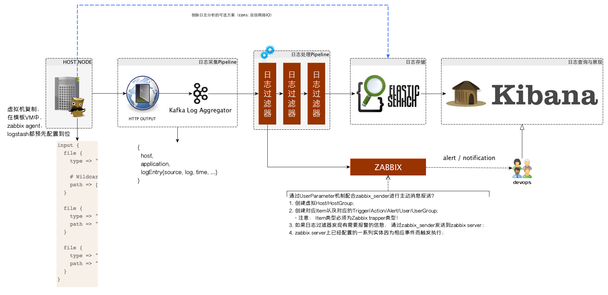

% 构建挖财自己的日志采集和分析体系
% 王福强
% 2015-03-12

# 为什么要做日志采集？

日志， 对于不同团队来说会有不同的使用目的：

1. 对于数据仓库团队来说， 日志是他们要分析的信息数据来源之一；
2. 对于安全团队来说， 日志是他们构建安全防御与漏洞挖掘的一种特征来源和触发信号源；
3. 对于应用团队来说， 日志是他们了解自己的系统运行状态与排除错误的一种手段；
4. etc.

在服务结点不多的情况下， 各个团队怎么使用这些日志或许可以百花齐放，但在中大规模服务部署的情况下， 日志类别 * 技术方案 * 对接的系统等等这些因素的组合将极大加重系统研发和维护的负担，所以， 我们需要一套分布式环境下集中采集，分析和管理日志的技术体系。

> 最原始的登录服务器查看日志等操作，对于信息安全要求需要逐步加强的互联网金融企业来讲， 最终一定是要杜绝的，权限收缩并规范化管理我们将逐渐执行落地， 届时， 所有的日志查看，分析等工作将只能通过我们的日志平台进行。

# 挖财自己的日志采集和分析体系应该怎么建？

一套日志的管理体系通常需要处理以下几个阶段的工作：

1. 日志的采集
2. 日志的汇总与过滤
3. 日志的存储
4. 日志的分析与查询

ELK技术栈(即Logstash + ElasticSearch + Kibana)属于业界已经应用比较广泛且成熟的开源方案，这套一站式解决方案基本上可以满足大部分企业对日志管理体系的需求，但对于我们挖财来讲， 需要更多的灵活性以处理遗留系统以及现有技术基础设施的复用， 故此， 我们自己的日志管理技术体系我希望是如下的样子：

## 日志的采集

灵活性是我们选择日志采集方案更看重的因素，所以logstash属于首先方案， 它可以兼顾多种不同系统和应用类型等因素的差异，从源头上进行一些初步的日志预处理。

> logstash唯一的小缺憾是它的不轻便， 因为它是使用jruby开发并跑在java虚拟机上的agent， 当然啦，同时也是优点，即各种平台上都可以用。

## 日志的汇总与过滤 

kafka在我们挖财已经属于核心的中间件服务， 所以， 日志的汇总自然而然会倾向于使用kafka。

日志的过滤和处理因为需求的多样性，可以直接对接订阅kafka， 然后根据各自的需求进行日志的定制处理， 比如过滤和监控应用日志的异常，即使通过zabbix进行预警； 或者数据仓库方面在原始日志的基础上进行清洗和转换，然后加载到新的数据源中；

## 日志的存储

原始的日志存储我们采用ElasticSearch， 即ELK技术栈中E的原本用途，遵循ELK技术栈中各个方案之间的通用规范， 比如日志如索引采用logstash与kibana之间约定的index pattern。

日志的衍生数据则日志使用各方根据需求自行选择。

## 日志的分析与查询

ELK技术栈中的Kibana已经可以很好的满足这一需求，这里我们不折腾。

# 需要解决哪些技术问题？

因为我们在ELK技术栈的处理链路上插入了一些扩展点，所以，有些问题需要解决和澄清...

## logstash与kafka的对接

ELK技术栈中， Logstash和Elastic Search是通过logstash的elasticsearch或者elasticsearch_http这几个output直接对接的， 为了让logstash转而对接kafka，我们有几种选择：

1. [logstash-kafka](https://github.com/joekiller/logstash-kafka)
2. [logstash-output-kafka](https://github.com/logstash-plugins/logstash-output-kafka)
3. logstash的`http`output

第一种和第二种方案都需要编译打包相应的依赖到logstash，然后随同logstash一起部署到服务结点， 虽然可以work， 但依赖重， 资源消耗多， 通用性不强；

个人更倾向于第三种方案，即使用logstash默认提供的http这个output， 因为http比较通用， 而且本身我们的kafka前面就有为了多系统对接而提供的[http proxy](http://git.caimi-inc.com/money/csw-kafka-frontier)方案部署。另外，依赖的管理和升级都在服务端维护，对每个服务结点是透明的。 当然， 唯一的弱点是效率可能不如基于长连接的消息传递高，只是暂时不是问题，即使将来成为瓶颈，也可以通过sharding的形式进行扩展。

## kafka到elastic search的数据链路对接

kafka和es之间我们要加入一套日志过滤与处理系统， 这套系统是我们发挥整个体系最大威力的地方。 在整个系统的处理pipeline中，我们可以根据需求添加任意需要的Filter/Processor, 比如服务于应用报警的Filter/Processor，服务于数据仓库ETL的Filter/Processor等等。 但不管前面做了多少事情， 日志最终是要接入到ES进行存储的。 

因为ELK技术栈中三者的对接遵循一些规范或者说规则， 而我们又需要继续复用这个技术栈中的服务提供的特定功能， 所以，即使是我们在整个处理链路中插入了扩展点，但数据的存储依然需要遵循ELK原来的规范和规则， 以便Kibana可以从ES中捞日志出来分析和展示的时候不需要任何改动。

logstash存入ES的日志，一般遵循如下的index pattern：

<pre class=".pre-scrollable">
logstash-%{+YYYY.MM.dd}
</pre>

使用日期进行索引（index）界定的好处是， 可以按照日期范围定期进行清理。

> NOTE
> 
> 进一步深入说明一下， **针对不同的日志类别， index pattern也最好分类对应**。

> 更多信息: 
> 
> Each log line from the input file is associated with a logstash event. Each logstash event has fields associated with it. By default, "message", "@timestamp", "@version", "host", "path" are created. The "message" field, referenced in the conditional statement, contains all the original text of the log line.

日志处理系统可以使用ES的java客户端或者直接通过ES的HTTP服务进行采集到的日志索引操作。

### 参考

1. <http://www.rsyslog.com/output-to-elasticsearch-in-logstash-format-kibana-friendly/>
2. <https://sematext.atlassian.net/wiki/display/PUBLOGSENE/Index+Events+via+Elasticsearch+API>
3. <http://stackoverflow.com/questions/27127326/is-logstash-a-mandatory-prefix-of-indices-in-kibana>

## 日志报警功能与zabbix的集成

我们的监控平台选择了使用zabbix， 所以各个系统如果有监控需求，最好都对接zabbix， 避免维护多套不必要的运维系统。

在应用日志处理过程中， 我们希望可以识别错误或者异常信号， 然后通过zabbix报警和通知相应devops人员， 为了达到这一目的，我们可以复用zabbix中的action/user/usergroup等实体配置， 并且配置相应的虚拟host/item/trigger等实体，然后由日志处理系统在需要的时候，直接通过active的方式上报数据， 具体操作方式为：

1. 在日志处理系统中， 通过zabbix_sender或者根据zabbix_sender的通信协议，在合适的时机发送状态数据；
2. 在zabbix中， 配置相应的host/item/trigger， item为zabbix trapper类型，key与zabbix_sender发送的key相对应；
3. 其它配置根据需要配套即可（找zabbix管理者提需求即可 - @多宝）。

> TIPS
>
> zabbix_sender协议参考<https://www.zabbix.org/wiki/Docs/protocols/zabbix_sender/2.0>

# 补充和小结

虽然我在架构图中从具体的服务器结点通过虚线的形式引入了一条直接到ElasticSearch和Kibana的链路，但并不推荐这种方案， 原因可能是（但不限于）:

1. 本身我们的日志管理体系中对日志的处理/过滤需求是不可避免的， 所以， 日志的存储入库可以通过一条链路直接完成， 只维护一套规范即可；
2. 在每个结点开两个口子， 本身会对网络IO造成双倍压力；

所以， 以上架构规范中所有推荐的做法是综合考虑后最完善的方案。

> 感谢千米网CTO曹祖鹏曹总的大力支持，哈哈

