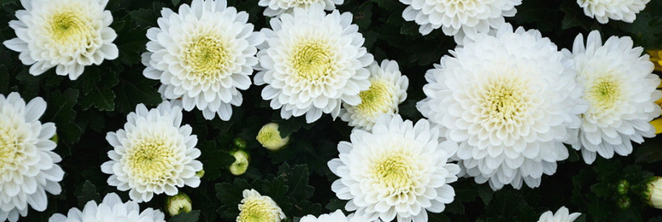

% 思忆外婆

> 2014年从msn space存档中重新恢复出来！

今天二舅打电话过来，问我能不能回去给外婆烧三年，我才发现原来我一直都在内心深处压抑着某种东西，虽然我以工作忙为由说回不去，实际上我知道这不是我的理由，不是不能回去，也不是不想回去，而是一直情怯于此...

其他方面我或许还算过得去，但各种情感的处理上，不可否认，绝对的懦夫！明明想好好孝顺父母，明明想要他们知道自己多么的在乎他们，爱他们，但就是不知道如何去表达这些，对外婆更是如此。

外婆是我毕业后参加工作的第一年春节后过世的，那个时候我正在常州，冬天，那个地方最冷的时候，直到外婆入土为安了妈妈才告诉我这个噩耗，她不想我回去，她一个人伤痛就算了，不想儿子陪她一起，但是当时我的眼里明明有一股温热的液体不住的涌出，没有缘由，虽然一再想去制止，却根本就是徒劳…

从小到大，我努力学习，好好工作，就是为了能够将来多争一些，让家人幸福一些，对父母，对外婆孝顺一些，但是，我发现我这这种观点或者说最初目的是如此的单纯和愚蠢。我毕业第一年就买了数码相机，还是借钱买的，不是为了好玩，纯粹为了春节回家能够跟家人合个影，纯粹的为了能够留下更多外婆的身影，但老天爷就是这么“通情达理”，那年春节，是我最后一次见到外婆，那年春节留下的照片也是外婆留给我妈和我们的最后一张合影，那年春节我应该再多陪陪她…

当我还是小孩子的时候，妈妈几乎每周最多一个月都要带我回外婆家一趟，在我的成长过程中，春夏秋冬，一贯如此，而每次回去，外婆都会准备我最爱吃的饺子，虽然那个时候我并不讨外婆喜欢，甚至老是跟表妹抢东西惹她生气，但是，这并不妨碍我每次吃到外婆做的饺子，我知道那是专门为我做的，虽然表面上还是对我凶巴巴的，但是内心却并非如此，一直到我长大了，参加工作了，外婆才真正对我和蔼，从那年春节拉着我的手不放，我能够感觉到她对我有多在乎。

有的时候，妈妈可能有事情不能去外婆家（也就是二舅家），而我又能够自己骑自行车的时候，狂奔13里地对于那个时候的我来说，不是路途遥远，而是近在咫尺，除了上坡，大部分时间我都是在双脚狂登，1个小时的路程我要缩减的更短，我也不知道什么原因，每次皆如此。其实，表哥表弟不在家，只有表妹在的时候，对于小时候的我来说，去外婆家一点儿意思没有，跟她们玩不起来的，但是，我就是那么急切，没有原因的急切，急切的想去，或许就因为那顿饺子。老妈从老早就开始教我擀饺子皮，却总也教不会，反而是外婆教会我擀饺子皮和包饺子，我只记得那次就我自己到外婆家，平常妈妈会帮外婆一起包，这次没来，看外婆一个人包，我有些于心不忍，于是主动要求外婆教我，就那次之后，我学会了，而且一发不可收拾，同时擀给三到四个人一起包都没问题…

外公早年过世，外婆一个人拉扯我妈兄妹4人（据我妈说她还有其他兄弟姐妹，但那些年闹饥荒和自然灾害…）,为了生活，当年一个人去生产队争工分，到处挖野菜，甚至偷偷饲养“资本主义尾巴”。我妈一直埋怨外婆没有让她继续读书，小学一年级读完就让她辍学了，但我知道老妈并不是真的要埋怨外婆，老妈也知道，虽然当年外婆一个劲的赶她“出门”，实际上也并非外婆所愿，外婆也一直难受于此，所以老是盼望老妈经常回去看看，即使老妈没空，起码我过去也好，每次离开，都大包小包的往自行车上绑，因为外婆知道，我们家那个时候境况并不好，吃菜都舍不得，而外婆家有一个很大的菜园，所以自然而然我和老妈回外婆家就跟打劫没有什么区别…

从我上高中，大学，学业繁忙，甚至相隔更远的两地，去外婆家的机会明显比原来少了许多，只能放假和节假日才能去一趟两趟，而我也不是小孩子了，所以，不会像原来那样做各种让外婆生气的事情，虽然即使做，她也不会像原来那样责骂我。这个时候的外婆虽然不用像以前那么操累，但我还是能够感觉，她实际上并不十分快乐，因为儿媳妇有时候说话和态度对她不好，虽然我也知道，但我作为晚辈也不知道如何处理，我心向外婆，却有心无力，我二舅是个好儿子，孝顺儿子，远近闻名，但二舅母却并非如此。所以，每次我在的时候，都会想尽办法调节这种气氛，但实际上我没有想出任何办法，我只能内心默默地祝福外婆。

从我上大学到毕业，外婆见到我都是笑盈盈的，因为我们家出了个大学生，而且从小成绩优异，为家里争光了，或许因为我的缘故，外婆时常会对老妈唠叨当年没有让老妈继续读书的事情，但我知道，当时情况没有办法，老妈也理解，外婆也只是想向老妈表达当年那种歉疚吧，可是又有谁会怪她那？！

外婆的一生其实是愁苦的一生，好日子没有过几天，当我毕业了想多挣点儿钱孝敬她老人家的时候，她却不给我这个机会，呜呼~，每想至此，都禁不住热泪盈眶…

外婆后半生的最后几年因为半身不遂，是在炕上度过的，偶尔出门晒晒太阳，也是我妈回去看望她的时候，我因为在外读书，所以也不能经常回去看她，应该比较愁苦吧，想到这里就会鼻子发酸…

2007年2月27（阴历）是外婆去世三周年的日子，谨以此文献与她，希望她在天堂可以快乐，并一直庇佑着我们…

亲戚或余悲，他人亦已歌，死去何所道，托体同山阿...

我可以把死亡看的豁达，但为什么我却禁不住那满面的泪水，任他们肆意，而不想抚去…

于2007年4月13号晚