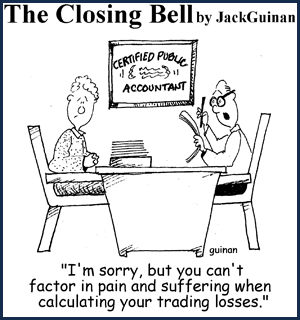

% "factor in", you know these words, right?!

> 2014年从msn space存档中重新恢复出来！

今天无意中看到的一副漫画,或许我现在退化实在太厉害，愣是没看太明白这副漫画想要表达的确切意思，md，单词都认识，就是搞不太懂，呵呵，这就是为什么有阅读理解这样的东东吧！

好在恰好renxian同学在线，正好抓住问吧，谁让她正好专业english那。跟我英文解释一通，in vain，还是不懂，只有最后一句亲切的中文才把我点明白。

<blockquote>
factor in: 

…的因素

例句与用法:
1. The injury to their key player could be a decisive factor in the game. 
 他们主力队员受伤可能是这场比赛胜负的决定性因素。
2. The committee's support is an important factor in the success of the project. 
 委员会的支持是该项目取得成功的一个重要因素。
3. The main factor in the market is that the supply of Chinese antimony is quite limited. 
 市场的中心因素是中国对锑（antimony）的供应有限。
4. A fine script is the most important factor in producing a successful film. 
 一个好的电影剧本是制作一部好影片的重要因素。
</blockquote>

这个是dict.cn上的解释，呵呵，难怪我搞不明白，按“刘老师”的意思，factor in这里的意思是to include 的意思，这里也就是不要把你的痛苦之类的东西计算在内。呵呵，我开始以为是不要让你的交易损失成为你的痛苦的原因之类的意思，问题是这样理解就没啥漫画的意味了。

"我觉得就是说，这个人炒股票赔了钱，然后去会计师那里上税，但是美国炒股票如果赔钱的话就不用上税，或者可以少上税，所以她想把他心理上的痛苦也算在内，就可以上更少的税了" 

OK ,I couldn't agree more.