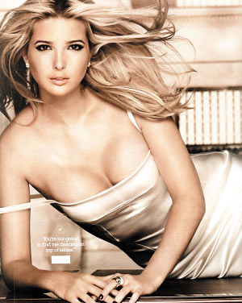

% 感慨一下

> 2014年从msn space存档中重新恢复出来！

 美女啊，呵呵，知道这谁吗？！看过The Apprentice没有，没看过？！那我跟你没有共同语言了，哈哈，kidding，没关系，反正看过的朋友都知道里面那个老大是谁，Donald Trump，NewYork地产大亨，美女是他闺女。不过，漂亮还是其次的，毕竟这个世界上美女数不胜数，最主要的是，年纪青青却能有如此大之作为：
 25岁的年纪，当过世界超级名模，是美国纽约房地产巨鳄“特朗普集团”副总裁，未来将要继承大约21亿美元的巨额财产，连续第二年登上美国《福布斯》杂志的全球十大未婚女富豪排行榜榜首，世界上还有哪个女孩，能比伊万卡·特朗普(Ivanka Trump)更幸运呢？ 
 在这个拥有豪华游艇、一座有140个房间的豪华别墅和21亿美元继承权的女孩身上，没有一点娇生惯养的坏毛病。在她25年的平坦“钱途”上，有30%是借了家族的“光”，而70%则全靠自己打拼。

 我感慨在哪里那？！不是她有多么漂亮，也不是她有多么富有，我感慨人为什么会有这么大的差别！

 呵呵，各位看官不要误解，我这里不是愤世嫉俗，我这里是要探讨观点。

 记得前阵子早上值班，完成后，无事可作，就直接装了个PPLIVE看东方财经那个频道，上面正播出头脑风暴，没有看全，从半截开看的，所以只能说说大意，好像是要比较外企和民营企业各有什么优势，为什么毕业生都愿意往外企跑，其中一段关于员工的职业生涯的发展之路的对比尤其鲜明：

 * 如果你进入外企，外企有一套成熟的体系来保证你的职业生涯规划，第一年让你做基层，了解企业运作，第二年让你做销售，培养你的沟通和社交能力，第三年让你做其他，又是培养你的什么能力，直到确定的n年之后，让你做到部门经理；
 * 但如果你进入民营企业，企业对你也不错，一位老总说了，“我给你一片天空，你自己去折腾，成功了，你就是英雄，失败了，你就是狗熊”；

 呵呵，怎么样?!够鲜明的了吧？！

 所以，我感慨什么，你也应该清楚了，只可意会不可言传哦^_^