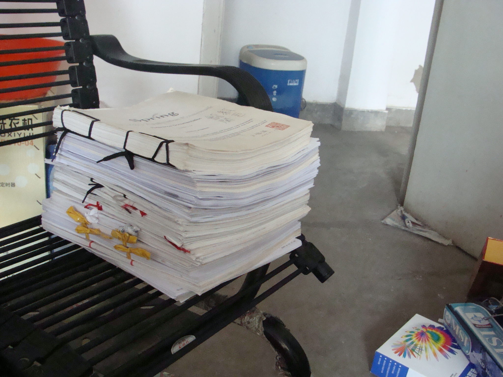

% 家底儿 
% FuqiangWang
% 2009-05-28

今天开始整理家当，该扔的扔，该打包的打包，发现这几年倒是积攒了不少文档，虽然扔掉了不少，可还是留下了一堆， 舍不得扔， 打算送给现在公司的同事吧， 物尽其用嘛， 看着这一摞东西，心里不知道是一种什么滋味， 沉甸甸的，有几分成就感或者自豪感？ 可是，又或许有几分苦涩，说不出来的感觉， 居然还发现了一本Spring1.1.4时候打印的一大本文档， 呜呼...

书先装了一箱子，发现太沉，基本不成，等周末去小郭儿那里搞几个小一些的吧， “小规模转储”一下，不然这些宝贝书籍还真让人头疼， 书呆子，所以，家底儿最多的也是书，呵呵
 
剩下的小冰箱， 微波炉，电脑桌，椅子，热水器，哦，还有个折叠自行车(A Bike)， 如果哪位大连的朋友愿意要可以跟我说，呵呵， 变卖家当啦!