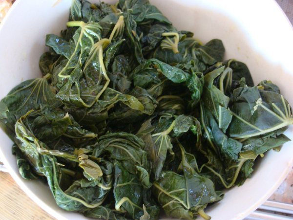

% 回家过中秋，在招远转了转，拍了几张照片，感觉还不错，呵呵

> 2014年从msn space存档中重新恢复出来！

另外， 各位看官吃过这东西没？哈

----------------------------------------------

<pre>
Comments

xl33 liu - 10/10/2009 8:54:55 PM

没想到你回家过节了，呵呵。这是什么好吃的啊？没见过······
Wang Darren - 10/12/2009 7:37:11 PM

哈哈， 小丽居然都不认识这个东西？
辰 毕 - 10/12/2009 10:56:17 PM

这一定是菜
波 - 10/13/2009 9:45:42 AM

是芹me菜么
天连 曲 - 10/13/2009 11:15:19 AM

野菜？？
Wang Darren - 10/17/2009 2:04:53 PM

hehe, 我就随口提了这么一句，居然这么些人关注啊， 其实也不是啥上得了台面的东西，“地瓜叶子”，我只是回老家就愿意让老妈给弄点儿吃，忆苦思甜一下，呵呵
xl33 liu - 10/22/2009 11:07:27 PM

真是地瓜叶子啊，看了像，还真没敢往那上面猜。
不过我现在倒是挺馋地瓜梗的，呵呵。
qiuying wang - 10/23/2009 1:12:17 PM

第一次见，地瓜叶水煮就可以吃？
我老妈，种了一种菜，叫做“番薯空心菜”，好像是，地瓜叶和空心菜的杂交，哈哈，那个菜，爆炒可相当好吃呢
</pre>