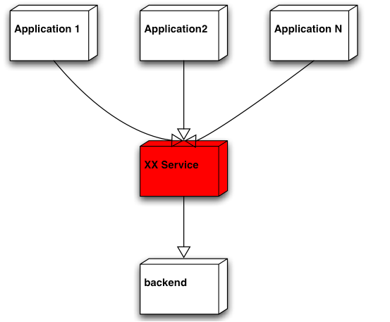
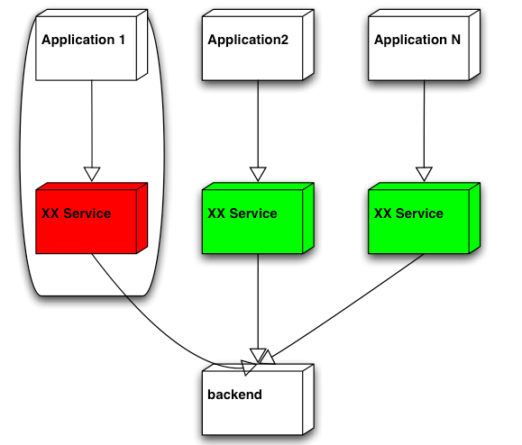

% Simple, Yet Powerful系列之“隔离”

隔离的概念其实很简单， 但越是简单的东西， 就越不能小看。应用得当的话， 可以让我们的系统“天生丽质”， 一出生就在某些方面领先他人一步， 不信， 咱上眼瞧...

# 隔离以提高系统的容灾 

部门本来有一个项目可以满足其它部门的需求， 但一些架构师不想使用现有的这个项目，而要另起炉灶， 其中的一个原因是某个应用如果突发状况致使统一的服务down掉， 那么使用统一服务的其它应用也将受牵连， 让我们来看一下为什么会出现这种情况。

显然， 按照这样的部署， 以上架构师提出的反对意见是说得通的。但这并不应该成为不使用现有这一项目的根本因素。因为， 我们完全可以通过调整部署来规避以上问题：

现在， 即使某个应用将它对应的服务搞死， 其它应用和他们相应的服务也不会受到牵连。 通过隔离， 我们系统从一开始就具备了一定的容灾能力。

> NOTE
> 
> 所以，提出隔离以提高系统自身的容灾能力的反对意见， 这是可以接受的， 但如果是针对图1的部署提出这样的反对意见， 那就说不过去了， 因为即使是使用独立部署的服务， 同样可以通过调整部署结构来达到同样的目的。其实， 引入了过多的服务器增加了成本这样的异议或许更有说服力一些。 毕竟，如果其它方式能够达到同样目的， 却不需要引入更多服务器的话，这样的解决方案一定会比最初的方案更有吸引力一些。

我不确定优雅降级这个概念是不是ebay第一次提出来的， 反正我是几年前从它的架构PPT中第一次听到这个名词。系统的优雅降级意味着当系统的某个功能或者节点之类失效或者服务能力丧失之后， 整个系统可以优雅的平缓的降低服务质量， 但不能完全丧失服务能力甚至是崩溃掉。要达到这个目的， 显而易见的方法就是剥离“坏细胞”， 隔离它， 以避免其对周边甚至整个系统造成进一步的创伤。

这里， 隔离的概念又一次彰显威力。

其实， 不光是在我们的软件系统设计领域， 在其它领域的设计中， 隔离的理念也同样被使用。

比如， 船舶或者潜艇的涉及中，各种舱室的设计尤其是密封舱的引入， 其实都是通过隔离来保证整艘船只的容灾能力。即使在舰只被鱼类或者炮弹击中， 只要一定数目的密封舱可以存留， 那舰只就可以避免沉没的命运。

再比如， 坦克的弹_药仓和成员仓通常在设计和实现上也是隔离的， 即使弹_药仓不幸中弹， 引起的爆炸也不至于波及到成员仓中同车成员的安全，伤害被隔离在一定的范围之内不至于扩散。

说了这些多， 实际上就一个意思， 隔离， 可以帮助我们提高整个系统的容灾能力， 该用当然就得用咯， 又不是什么复杂的概念， 是不？

# 隔离以规避状态的冲突 

事务的隔离级别大家应该不陌生吧？那它的作用是什么那？我知道， 把它归到并发控制策略那边或许更合适一些， 可我这里要说隔离， 所以， 我就死拉硬扯地， 把它先暂且划归这里一会儿吧。 通过事务隔离级别，我们可以控制数据的可见性， 从而在一定程度上规避共享状态地某些冲突， 或者说即使有冲突， 我们也可以按照预先设定地策略进行规避（MVCC）， 但扩展来讲，如果我们能够将某些关注点从一开始就隔离开来的话， 那也就从根本上规避了某些状态地冲突， 至于相应地， 系统更易于管理和维护，以及更加易于扩展之类的好处， 那自然而然就都随之而来了。 这么“一石多鸟”的事情， 可能的情况下，应该多为才对。

# 结束语 
本来我还想胡搅蛮缠一下扩充点儿篇幅， 想将“关注点／功能／服务／系统”的治理和维护也纳入道这个topic下， 但发现“隔离”和”分离“语意上可能还是有些差异的， 所以就此作罢， 先写一部分确定的内容吧！