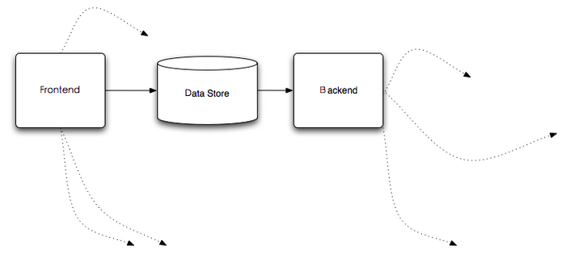

% 分布式数据访问与同步场景浅析

其实不想说这东西， 因为我也不知道正宗不正宗，完善不完善， 而且， 往简单了说，就2点， 简单的要死， 不过，我感觉我要真的不说，有些人可能也真的不知道我在说什么，而且今天有点儿小破事儿， 也促使我 就此 “嚼嚼舌头 ” 。当然一家之言， 看官自己掂量。

随着应用数据规模的增长， 相应的数据库集群自然而然的浮出水面， 进而， 为了应用和管理位于这些数据库集群中的海量数据，你通常会提供一个分布式的数据访问层， 由这一层来屏蔽分布式环境下数据库集群的数据访问复杂度，此为一；另外，你要保证系统的高可用性， 或许会对数据库集群整体或者某些节点进行备份， 这些备份或许发生在在同一个数据中心，或许发生在位于不同地理区域内的数据中心， 因此，你或许会寻求数据复制技术来达此目的，此为二；另外，面对海量的数据，不同的应用有不同的使用角度，如何将同一份数据有效的分发给不同的应用来使用，也是需要你来考虑的问题。

要处理这些东西， 我们可以以数据存储为中心， 从前面和后面两个角度来解决。 Just like this:

# FK Data Store From The Front

不用说大家都知道， 要做数据访问（不管他是不是分布式的）， 指定得从数据存储前面进行。 分布式的数据访问解决方案大都如此， 要是我漏了啥，欢迎补充，呵呵。

尽管都是为了做分布式的数据访问， 大家的具体解决方案可能会稍有不同， 比如， 我们的ＤＡＬ或许只是一个简单的jar随应用一同部署， 又或许我们的ＤＡＬ是一个独立的服务， 比如MySQL Proxy, Ameoba等。

不过， ＤＡＬ不单单就这点儿料儿， 我们还可以让它帮我们做数据同步与数据备份之类的事情， 打个比方， 在做数据访问的同时，我们可以将同一笔数据的更新分发给其它服务节点， 这包括(但不限于):

1. 分发数据给search index builder， 以便实时的构建search index；
2. 分发数据给备份节点， 以便做数据冗余备份；
3. 分发数据给其它应用的数据存储，以便应用可以根据情况来进行相应的数据处理， 而不用对主要的数据服务造成访问压力；
 
当然， 从ＤＡＬ这一层或者说数据存储前端处理我们之前提到的那些关注点，最好提前对整个系统的状况进行评估，以便ＤＡＬ的设计可以在后期不会受到很大的冲击。而且，像避免ＤＡＬ成为单点之类的ＨＡ关注点，也都是需要在设计ＤＡＬ的时候要考虑的。

# FK Data Store From The Backend

从数据存储服务的屁股后面当然没法做数据访问啦，但我们可以做除了数据访问之外的事情，比如我们在前面提到的一些功能，像实时构建search index啦， 数据的备份啦之类。

那么如何从数据存储服务的屁股后面扣东西那？ 以RDBMS为例， 大部分vendor的产品都会包含事务日志的记录， 比如Oracle的redo log， MySQL的binlog等， 数据库会将数据的变更记录到他们相应的事务日志中，而我们也就可以通过监听相应事务日志的变化来获取数据的变化， 拿到这些数据的变化，你还用担心不知道怎么用它们吗？

不过这种方式有些时候也不见得行得通， 像MySQL这样开源的数据库，它的内部实现以及协议之类的资料都可以找到，这种方式显然行的同；而像Oracle这样的商业产品， 它的内部实现以及相关协议是不公开的， 要强行走这条路，你或许要花费很大的力气去hack它的内部协议，而且还不见得最终hack出来的东西完全正确。

总之， 有些路并非总是一路坦途，呵呵

# The end

应该说， 这两个角度的方案都不见得尽美， 但合适的场景选择合适的方案， 甚至结合起来使用， 这些方案完全可以帮助你达成目标。

What do u think about what I said? bullshit(fucking easy)? or something that's useful to you? Your feedback will be welcome.

