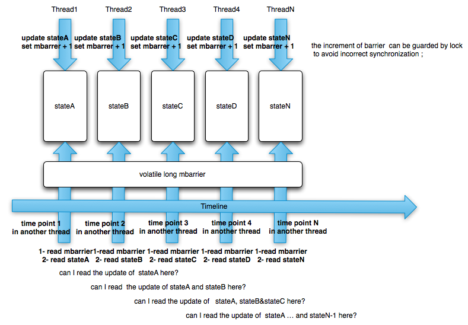

% One Of My Memory Barrier Questions
% fujohnwang
% 2011-10-26
 One Of My Memory Barrier Questions

As JSR133's **volatile** semantic description after Java5, I now get a better understanding of **volatile**'s half memory barrier feature. 

Simple words:
> If thread1 update a volatile variable and thread2 read the same volatile variable, then thread2 will also read the updates the thread1 did to other variables.

I don't know whether my words are correct, let's assume that's the thing it is, so that I can continue with the question description.

Let's say we have multiple writer threads and multiple reader threads, the writer thread will update several variables and a following volatile variable, and the reader will read the same volatile variable, then read other variables's values, the question is, will the reader also read the updates done by all of earlier writer threads at its time point?

Here is a picture I draft to describe the scenario: 

 
And A sample code gist:

If At Time Point 2 A reader thread can read all of the updates done by writer thread2, then will it also read all of the updates done by writer thread1 at time point 2 too?
If so, what about time point3, 4, 5, etc...

My understanding is, that answer is Yes. But I am not so sure.
