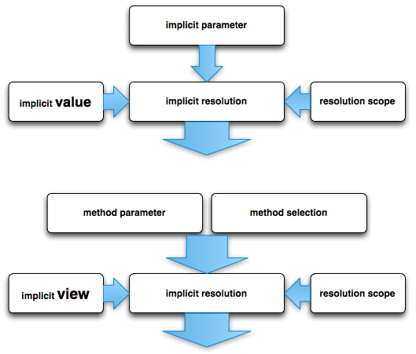

% revisit_implicit_resolution_in_scala
% fujohnwang
% 2012-07-30
__author: fujohnwang__

implicit在日常的Scala编程中不是很经常用，间隔以时日，很容易忘记如何区分implicit resolution或者implicit conversion的时候，到底是以目标类型为基准，还是以起始类型为基准，故此，决定重新梳理一下…

implicit resolution的过程梳理如上图所示分为两种情况：

1. implicit value + implicit parameter
2. implicit view + (method parameter | method selection)

	第二种情况即implicit conversion.

每一种类型的implicit resolution的过程都牵扯三种元素：

1. implicit resolution的应用场景(implicit parameter, or method selection...)
2. implicit resolution的输入(implicit value or implicit view)
3. implicit resolution的输入查找范围，即implicit resolution scope

下面分别对两种情况下各自牵扯的三种元素进行详细说明...

# implicit value + implicit parameter
## implicit parameter
型如下：

scala> def foo(implicit p:Int) = p

可以明确的传入指定参数调用，也可以不传入参数调用，但是，对于后者来讲，要让编译器可以找到符合条件的implicit value来填补空缺才行。


scala> foo(4) // OK
scala> foo  // error: not enough arguments for method foo: (implicit p: Int)Unit.


## implicit value


scala> implicit val v:Int = 5
scala> foo // OK
scala> foo() // error: not enough arguments for method foo: (implicit p: Int)Int.


在REPL中声明一个implicit value之后， foo方法不传入参数即可调用成功(注意调用方式，不能加括号)，但是，除了REPL这种情况，还有那些情况下可以提供符合条件的implicit value那？！

## implicit scope

最简单的做法是，在任何地方声明，只要在使用到implicit parameter的之前import即可。
不过，为了避免每次都import，在implicit parameter类型对应的companion object中提供一个默认的implicit value作为默认值倒是一个不错的选择。

# implicit view + method selection/call

## method selection/call
场景一：


scala> def bar(message:String) = println(message)
bar: (message: String)Unit

scala> bar(5)
&lt;console>:13: error: type mismatch;
 found   : Int(5)
 required: String
              bar(5)
                  ^

bar方法expect字符串类型的参数，但我们却传入了Int类型的参数(5)，bang!

场景二：


scala> class Bar{}
defined class Bar

scala> val b = new Bar
b: Bar = Bar@18760838

scala> b.go
<console>:14: error: value go is not a member of Bar
              b.go
                ^

声明了类型Bar，但调用了它并没声明的方法go， bang!

实际上，只要为以上两种场景提供相应的implicit view，那么就可以避免出错的命运...

## implicit view

implicit view用来将一种类型转换为另一种类型，其一般形式为：

implicit def <myConversionName>(<argumentName> : OriginalType) : ViewType

简单来讲其实就是一个OriginalType=>ViewType的函数，只不过要以implicit方法的形式来定义。

针对场景一和场景二，我们提供相应的implicit view如下：


scala> implicit def int2String(i:Int) = i.toString
int2String: (i: Int)java.lang.String

scala> bar(5)
5



scala> class Go{def go()= println("gogogo")}
defined class Go

scala> implicit def bar2Go(bar:Bar) = new Go
bar2Go: (bar: Bar)Go

scala> b.go
gogogo


## implicit scope

与implicit parameter的resolution scope类型， implicit conversion使用的implicit view定义也可以定义在任何位置，然后在使用的位置import就行了，但与implicit parameter可以在implicit paramter类型的companion object中定义默认implicit value不同，implicit conversion用到的默认implicit view需要在起始类型(即OriginalType)的companion object中定义，而不是expect的类型。

# Conclusion
1. implicit parameter做implicit resolution的时候，如果以companion object作为implicit resolution scope的话， 以implicit parameter类型的co为基准(也就是implicit value的类型对应的co)； 而implicit conversion如果以co为irs的话， 则以A=>B中A类型的co为基准！
2. 一般情况下， 可以在合适的companion object中定义implicit value或者implicit view作为默认值，但可以通过import或者其他方式提供其他明确的implicit value或者implicit view来覆写这些默认值。

# References
* "Scala In Depth"
