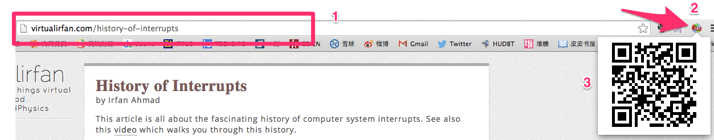

% 自用二维码Chrome插件/扩展 (A Chrome Extension of QR Code)
% FuqiangWang

经常在电脑上看到很多比较不错的内容想要分享到微信朋友圈， 原来个人比较笨的做法是，如果这个内容我也想同时分享到微博，那么，就在电脑上发布，然后通过手机上的微博客户端再Copy或者分享到微博朋友圈， 但如果只想定向分享到朋友圈的时候， 做简单的方式可能是直接拍张照， 但这别人是不友好的，人家没法看一下照片，在手机浏览器里输入一个字符，甚至如果有图像识别能够提取拍到的URL也可以，只是技术难度大， 估计也没有这种小工具； 如果有一些文件同步的应用，也可以通过粘贴文本然后同步到手机再分享，但流程依然复杂； 所以，我现在是拷贝URL，然后到某些生成二维码的网站，生成二维码，自己用手机扫了再分享。

不过， 拷贝，打开二维码网站，粘贴这样的动作对懒人来说也挺烦，所以，就想到了借助chrome扩展机制， 在地址栏边上一点击， 二维码直接显示出来就好了， 故此有了这个小东西。

# 过程与成果

首先当然是问问google老师怎么搞了， 搜到[Getting Started: Building a Chrome Extension](https://developer.chrome.com/extensions/getstarted)， 将sample下载下来， 然后根据情况进行更改， 查文档， 试验， 最终捣鼓出来， 放在<https://github.com/fujohnwang/goqr>, 有需要的客官可以自己git clone下来用， 就不作正式发布了。

效果如下:

# 安装使用
不想发布到google的store里面， 所以， 各位客官如果要用，简单说一下安装和使用的过程吧！

可以直接`git clone https://github.com/fujohnwang/goqr.git` 下来， 或者直接下载（["Download ZIP"](https://github.com/fujohnwang/goqr/archive/master.zip)）并解压,   在Chrome地址栏输入：

> chrome://extensions

选择右上角的"Developer mode", 之后点击“load unpacked extension...”按钮， 然后选择下载到本地的扩展的目录即可， 之后就能看到chrome浏览器地址栏上多了一个图标，安装完成。

> 对于非开发者来说，安装完后可以将"Developer mode"取消选取

现在，看到那个页面想分享，直接点那个新的按钮吧！

> 如果哪位客官脑瓜灵光点儿，可以在这个基础上做更多事情哦， 将来发了的话，记得请我吃饭就好，哈哈

# Refrence
 
1. [Getting Started: Building a Chrome Extension](https://developer.chrome.com/extensions/getstarted)
2. <https://developer.chrome.com/extensions/overview>
3. <https://developer.chrome.com/extensions/api_index>