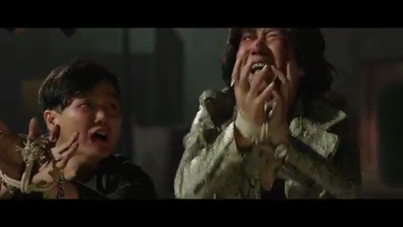
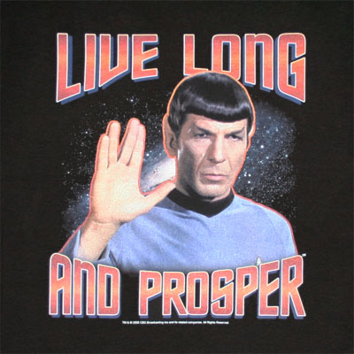

% Why I choose to leave (and start a new journey) today
% FuqiangWang with nickname in alibaba as 千任

Nowadays, we have many buzzwords, like, 'Event-driven X', 'Data-driven X', but I am an **Interest-driven** fellow, and I don't want to change what I am.

They say, 'I have loan to repay, I have .., I can't be driven by my interests anymore';  

I say^[of course, in my mind, haha], 'fuck it, I will keep on being driven by my interests'  

In other words, **Follow your heart**, and that's why I have given up some things they have, and I don't regret. 

I have a friend, a guy who is not like a technician although he still is, he like money very much and have a good sense on it, he tried all of the ways he can find to earn money and is still trying, and money is his goal (but I don't know whether it's his destination). I LIKE money too (we all do and we all need it, right?), but I don't think I will live for it only, I don't know how to spend money^[buying books? what a fucking nerd!] and don't have a strong desire to set it as my goal to chase, I always think I am chasing some ultimate knowledge status, maybe Wisdom it is. 

When I was young, my family was poor, I worked hard to earn more money, and I hope my parents can be happy and don't have to work hard anymore, that's my goal those years; These years, I have been thinking and seeking a new goal, 'cause earning salaries becomes meaningless. It's a mental hell I have struggled in for a long time.

The early-3-year working experiences in alibaba made me look like more geek^[this word can't depict that me well, I think], and benefited me to be promoted to Senior Technology Expert position, I appreciated this experience, because I knew I did throw myself deeply into the world of technology and academia. But the turning point comes, I fell off the cliff^[PT guys should know what happens] to 'zero', frustrated， mixed-up, luckily, I pulled myself together finally, and joined TMALL then found a new world. 

I knew more things besides technology here at tmall, people, product, marketing, internet things, commercial things, enterprise things, I watch, I think, I learn...

But my friends, I had a dream in my deep heart, and I never give it up, I can't wait anymore. I have to explore new ways to challenge myself, and on '**Battlestar Alibaba**', I don't think I can find one, no match, that's why I choose to leave to look for a sailing boat (or build one), not a ship, even more an aircraft carrier, 'cause I like sailing more than just steady seats. 

My new goal involves money things, but I think the dream to chase some wisdom is the key point and money should be one of the derivatives.

I have deposited too much, it's time to let it out！

BTW, I had always been had a illusion^[this is just a joke, don't take it seriously], that's, my CODE number in alibaba always makes me think the curve will match the path, ok, it does in my opinion, **28082**, rise steeply and fall deeply, then rise and fall again... Anyway, A happy ending I think, ；） 

Cross your fingers for me, my friends...

