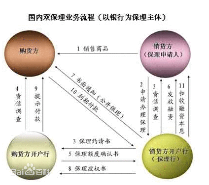

% 什么是保理业务？
% @陨石

> 保理是指卖方/供应商/出口商与保理商间存在一种契约关系。根据该契约，卖方/供应商/出口商将其现在或将来的基于其与买方(债务人)订立的货物销售/服务合同所产生的应收帐款转让给保理商，由保理商为其提供下列服务中的至少两项：
> 1. 贸易融资
> 2. 销售分户账管理
> 3. 应收帐款的催收
> 4. 信用风险控制与坏账担保

> 近年来，无论国内贸易还是国际贸易，赊销结算方式日渐盛行，以国际贸易为例，信用证的使用率已经降至16%，在发达国家已降至10%以下，赊销基本上取代了信用证成为主流结算方式。

基本上个人理解就是加快供应商资金回笼速度，外包对自己来讲非核心竞争力的财务相关职能。

---

**references**

- [保理业务](http://baike.baidu.com/view/1272040.htm)
