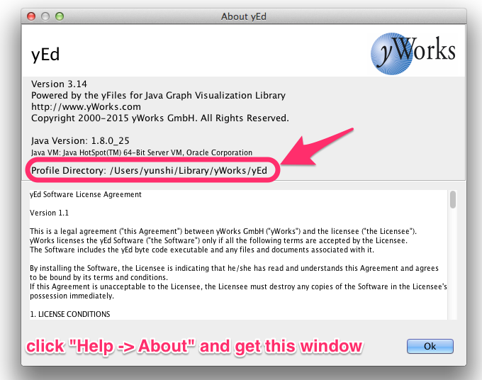

% yEd把我的配置都放哪儿去了？
% 王福强
% 2015-01-14

今天破天荒的好几个人问我的画图软件是啥， 应该是被哥劲炫的画图技巧给震撼了吧，哈哈， 其实工具真不重要， omnigraffle挺好的，就是太贵，买不起， 所以哥很久很久以前就找了这款[yed](http://www.yworks.com/en/products/yfiles/yed/)， 刚开始也不适应， 但稍作调整， 用的时间长了， 如果转而去用用omnigraffle反而觉得老不习惯了，效率也大打折扣。

其实yed默认的Palette里提供的图标没有几个好看的， 尤其是默认的黄不拉几的色调， 所以，我其实是自己定制了很多图标，但我一直没搞清楚，每次重装新版本，把旧版本删掉之后，这些定制的东西居然还在，故今天特意查了下，原来在这里：

