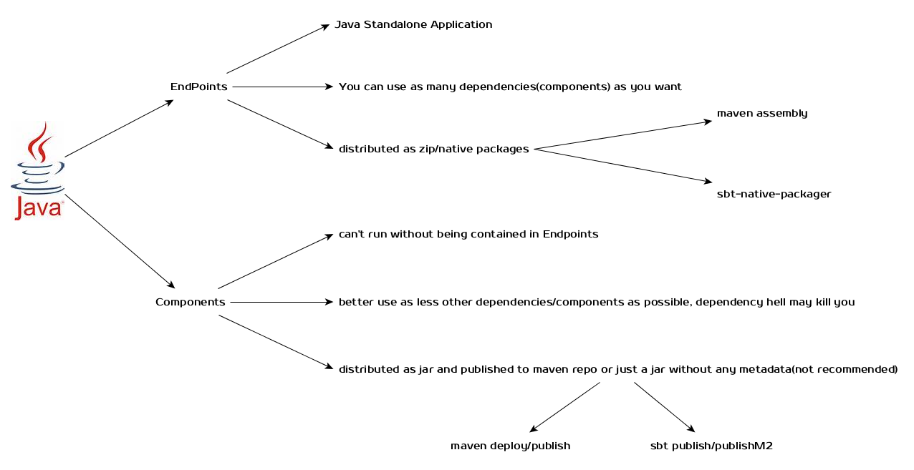

% Java/Scala项目设立原则
% 王福强
% 2015-03-24

所有的Java项目， 可以划分为两类：

1. component型项目（包括对外服务的接口，各种client等）建议使用Java进行开发和发布，以避免scala频繁的版本更新以及二进制兼容性考虑不多可能造成的依赖问题。
2. endpoint型项目可以自由选择使用Java或者Scala语言进行开发。

# Components型项目

也可以称为Dependency型项目， 一般是作为jar包发布，该jar包不可独立运行，一般作为其它可独立运行系统的一部分依赖存在，比如加入到各项目classpath的那些jar包，皆属于此类型。

这种类型的项目应该尽量减少变更， 维护API的兼容性， 而且尽可能少的减少自身依赖的其它component型项目的数量，为了尽量减少依赖的问题，甚至可以通过拷贝代码这样的实践方式，总之， 这种类型项目讲求的是精简，精致，可复用。

因为Scala在二进制兼容性方面的“恶名”， 建议Component型项目使用Java进行开发， 只有Scala特定的项目，比如SBT插件项目或者确实是Scala的Component型项目， 才建议使用Scala进行开发，但需要进行交叉编译，发布针对多个Scala版本的jar包。 

# Endpoint型项目

Endpoint型项目属于独立可运行的实体， 一般指Java的Standalone类型的应用， 特定的比如dubbo服务，playframework的web应用等。

对于这种类型的项目，没有特殊情况的话，可以说爱依赖什么包依赖什么包。

使用Maven发布这种类型的项目，一般使用[maven assembly插件](http://maven.apache.org/plugins/maven-assembly-plugin/)或者[maven的rpm插件](http://mojo.codehaus.org/rpm-maven-plugin/)； 使用SBT发布这种类型的项目，一般使用[sbt-native-packager](https://github.com/sbt/sbt-native-packager)。

