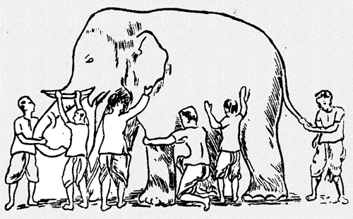

% 我为什么要做瞎子摸象的践行者
% FuqiangWang - fujohnwang AT gmail DOTA com
% 2015-07-16

瞎子摸象的故事， 我想没有人会不知道这个故事吧？！

这个故事通常用来讽刺某些人像这群瞎子一样，看问题过于片面， 可是故事真的就这么简单的结束了吗？

我之前写过几篇打了Tag的文字，叫#What's in a story#, 如果有心，你会发现，同样一个故事，如果我改变一个小小的因素或者细节，就完全可以扭转整个故事的基调，然后转而让这个故事为了另一个论点而服务， 也就是说， 故事怎么讲，完全是由作者要表达的论点来决定的， 媒体工作者通常有一个信条，叫做：

> Never let the truth get into the way of a good story.

说得其实就是这个道理， 故事最终是为某个目的服务的，否则， 干巴巴的讲论点， 或者再怎么苦口婆心的讲道理，也不会吸引多少人的关注力。

一个故事不但可以有二义性，还可以有多义性， 只是看你最终希望这个故事要帮助你表达什么， 比如同样这个瞎子摸象的故事， 扶墙老师就有不同的故事要讲...

# 新瞎子摸象的故事之个人篇

瞎子虽然眼睛瞎，但通常心跟明镜儿似的， 所以， 有一个瞎子听完其它人的陈述和争论之后，心里就犯嘀咕了， 为啥他们说的， 跟我自己摸完之后的感受不一样那？

于是这个瞎子就从这群争论的瞎子中脱离出来，转身回到了大象的身边， 这次他学乖了， 这里摸完之后， 换一个地方再摸， 我摸摸摸， 最终， 这个瞎子头上的那个灯泡亮了， “tmd，原来是这么回事啊”， 通过将不同时点和地点摸过的感受拼接在一起，这个瞎子终于大体上可以了解一头大象长啥样了...

# 新瞎子摸象的故事之团队篇

话说这帮瞎子吵啊，吵啊， 吵了[三天三夜啊， 三天三夜](http://music.163.com/#/m/song?id=28314058)， 这个时候，从他们当中蹦出一个team leader(或者外面给他们指派了一个team leader)， 说，“你们丫的别吵了， 先静静， 一个一个的说...”， 然后，这帮瞎子就One By One的又进行了一次陈述，当然，这次是比较冷静地进行了陈述， 当所有的瞎子都陈述完之后， team leader说， “那你们有没有想过，为什么你们每个人说的都不一样那？”， 然后这帮瞎子头顶的灯泡就都tmd亮了， “哦， 原来一头大象大体上长这样儿啊”

# 新瞎子摸象的故事之启示录

如果一个事物庞大到你无法一眼就看透它，了解它， 那么， 不妨先一小块儿一小块儿的去探索，然后再结合你探索的这些碎片成果进行拼装和推演， 慢慢地，你就会对这个庞然大物有了更多的了解（当然， 是否能够完全了解，我就不敢妄言了）。

这其实是一种方法论， 对于一些复杂的软件系统或者整个的世界来说， 一个人很难一上来就完全了解他们， 但你又不能就凭你的些许了解就断下结论， 否则你就有“旧的瞎子摸象”之嫌， 可是，你也不能畏头畏尾而畏缩不前， 这个时候，扶墙老师的“新瞎子摸象”的故事就可以派上用场了。 在这个方法论的指导下，你要么自己多从不同的层面去了解你要了解的目标实体， 你要么就结合其他人对同一目标实体的不同认识来了解它， 总之， 你手里收集的碎片越多，离你拼接并推理出这个实体的全貌就越近！

查理芒格很多年前就提出过一个理论， 叫“格栅理论”， 意思是说， 针对同一个事物（比如某个行业的企业）， 你能从不同的角度，运用不同学科的知识和实践方法来观察它， 了解它，那么，你就比别人更能看透它， 也更能为你的决策提供必要的定心丸， 其实， 这里说的也是类似的道理。

对于一个架构师来讲， 你最好是有[新瞎子摸象的故事之个人篇](#新瞎子摸象的故事之个人篇)中那个瞎子的觉悟和特质， 因为只有这样，你做出的架构决策才有可能是最合适的。 

哥前几天说过， 一个合格的架构师，需要能够 **own the big picture and make the best-match tradeoffs**, 其实这里的单词都是有讲究的，看起来容易，其实你要真做起来就不那么容易了， 打个比方来说， 我为什么用own， 而没有用have或者know？  比如什么叫the best-match tradeoffs?  the best-match的评判标准是什么？要知道什么叫the best-match tradeoffs，你又要做哪些工作？ 各位看官不妨去思考一下...

对于这个世界来说， 很多事情都复杂庞大到哥无法一眼看透他们，而我又没法转眼间就进化成神一样的存在，所以，我就只能像那个摸象的瞎子一样， 尽量的多去东摸摸，西摸摸了...

另外， 新瞎子摸象的故事，不仅仅只是作为方法论指导你个人的， 而且， 最好也能影响你周边的人， 一个人做所有的“摸象”工作太辛苦了， 效率也不见得高， 所以，不妨让大家都动起来， 相互分享， 我为人人，人人为我， 如果能够形成这样的氛围，那就善莫大焉了。 我愿意分享这篇文字，本身也在践行这一理念。

以上就是我作为一个**瞎子摸象的践行者**的宣言！

