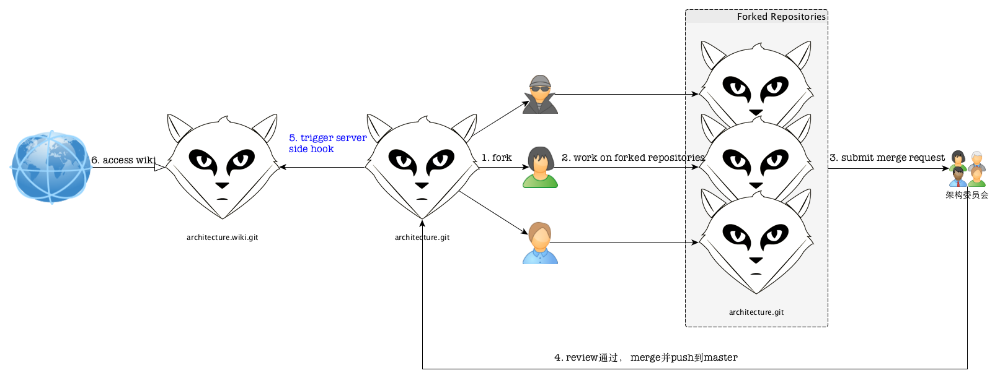

% gitlab的server端hook简要使用说明
% 王福强 - fujohnwang AT gmail DOTA com
% 2015-07-23

我们[挖财](http://www.wacai.com)内部所有的研发围绕着[gitlab](https://about.gitlab.com/)为起点而进行(gitlab as genesis)， 包括code， issues, wiki等， 大部分情况下， wiki是开放编辑的，但少部分项目牵扯到内容的review，所以，需要对这部分wiki进行一定时间窗口的“截留”， 比如，我们的架构规范， 一定是需要先提交初稿， 经过架构委员会review并通过之后，才可以正式发布， 但gitlab集成的wiki系统比较弱，所以，我们适当的进行了变通， 即wiki的编写和提交按照代码项目一样的流程， 新的架构规范提交后，需要提交merge request， review通过后再merge到项目的master， 这个时候，我们希望可以触发某个动作，来发布新的内容到wiki， 这里，就用到了gitlab的server端hook支持，整个流程大体上如下图所示：

gitlab的server端hook配置大体步骤是这样的：

1. 在gitlab的server端要配置server端hook的项目目录下新建一个`custom_hooks `目录；	
	- **注意** - 是在server端的repo目录下新建，即当前项目的git的bare repo， 而不是本地的甚至是clone后的repo！！！
2. 在custom_hooks目录下新建post-receive钩子文件；	- post-receive属于一个标准的shell脚本文件
3. 在post-receive钩子文件中添加相应的逻辑，将当前项目下的内容同步到同一项目的wiki目标repository；
	- *补充说明* - gitlab或者github的一个特性是， projectX.git如果是项目的repo地址，那么, 与之对应的wiki项目也有一个git的repo地址， 遵循一个命名convention， 即如果项目的地址是projectX.git，那么wiki的项目地址就是projectX.wiki.git， 我们的server端hook的执行逻辑根据这一convention而来；

我们使用的同步hook的内容如下，仅供参考：

~~~~~~~ {.bash}
#!/bin/bash

SCRIPT_DIR="$( cd "$( dirname "${BASH_SOURCE[0]}" )" && pwd )"

SRC_DIR=${SCRIPT_DIR}/../../architecture.git
DEST_DIR=${SCRIPT_DIR}/../../architecture.wiki.git

/usr/bin/rsync -avz --delete $SRC_DIR/ $DEST_DIR/
~~~~~~~

# 参考资料

<http://doc.gitlab.com/ce/hooks/custom_hooks.html>

