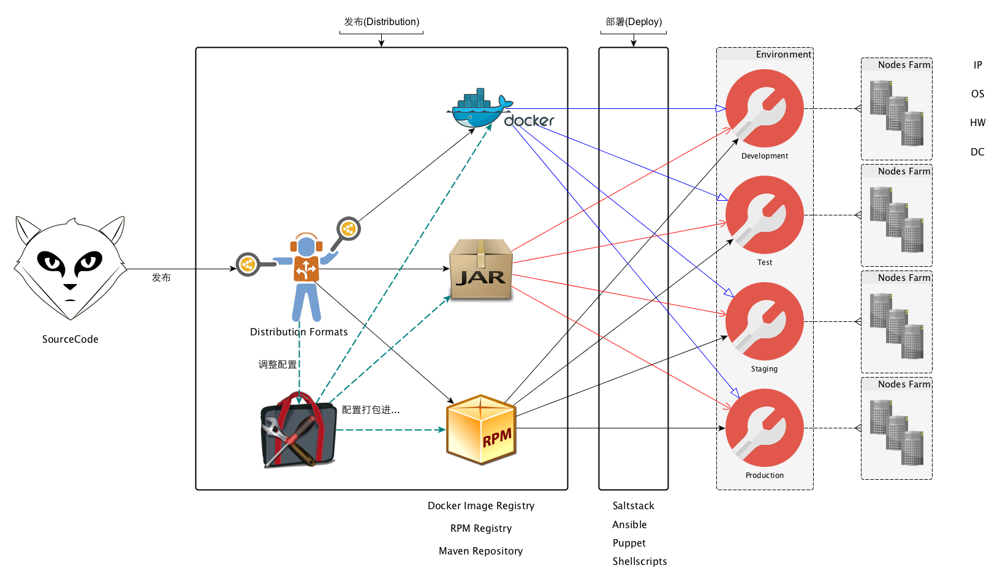
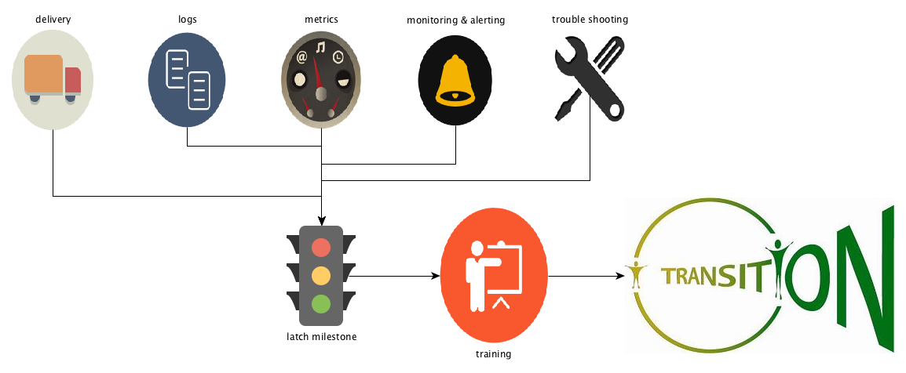

% 扶墙老师谈微服务(Microservices Essential)
% 王福强 - fujohnwang AT gmail DOTA com
% 2015-07-20

微服务的概念甚嚣尘上，你又是否为其迷茫而感伤？！^[[曹老师](http://weibo.com/p/1005051898667134)认为他之前看到的讲微服务的文章都没有戳到G点，所以受其所托， 谱下本篇文字。]

今天，扶墙老师将和你一起探究微服务背后的奥秘，请系紧安全带， 让哥带你装逼带你飞 ;-)

# 什么是微服务？

扶墙老师觉得吧，微服务真没那么神秘， 其实它也就是一种SOA的演化形式， 而且他更加侧重于**在服务的物理结构层面进行细分演化** ^[其独立部署的特点尤其突出]， 你可以理解为，微服务其实是指引服务的具体落地方案层面的一种实践方式， 而SOA实际上更侧重于相关的原则(Principle)或者理念。

虽然我认为作为一个总统候选人，Donald J. Trump有点儿逗比且很得瑟， 但哥想当年也是相当铁粉之的，他说的有些话还是很值得回味，比如这句：

> Before you lift into the sky, make sure you look down hard into the ground.

SOA的概念大家都知道， SOA的思想大家或许也都会认为自己领会的很好， 可是， 自己认为领会了，跟你领会的SOA思想最终能否指导你以比较好的方式来实践，这之间可能还有很长的一段距离。

话说扶墙老师刚到[挖财](http://www.wacai.com)的时候， 需要帮助业务线技术团队梳理各方面的关注点并解决相应的问题和瓶颈， 其中一个场景是， 团队发布经常延期，而且很容易出事故， 一开始以为只是SCM之类实践方式有待改进，真的钻下去看工程和代码才发现真正的问题之所在。

我发现， 业务线的projects是根据逻辑层来设置的， 类似于：

~~~
* func-web(project)
* func-serivces(project)
* func-dao(project)
* func-utils(project)
* ...
~~~

有没有觉得很匪夷所思？！ 其实一点儿也不用匪夷所思，我想在很多团队中也有可能存在这种现象（那些闷声发大财使用SOA很多年的公司现在是不是对此很不屑？）， 为什么那？ 因为如果你没有真正理解SOA的理念，或者你缺少一些正确的指引，只能自己摸着石头过河，那么你就是会做出这样的实践方式，要知道SOA更多强调的是逻辑上的理念， 而分层架构恰好又是提到的最多的架构逻辑上的典范， 自然而然的，按照分层(layers)将项目划分为如上结构，也就很是“自然”了！

但是，这样设置项目结构所带来的影响却是：

1. 开发一个功能，我不得不在多个project之间“辗转腾挪”；
2. 要发布和部署， 我首先需要等待并确认所有功能代码都测试通过待发布，然后再将包括了所有待发布功能的这些project一起打包发布， 如果有一个功能没有测试通过，不好意思，你就得等，这其实也就是早年淘宝架构师略显自豪提的“火车模型”，你得等所有车厢都装上才可以发车/发布；另外， 一旦我没有对当前发布基线要发布的所有功能进行确认就发布，只要有一个功能代码没提交完全，你发布就会失败，甚至发布了，上线就出问题；

那么，我们要怎么打破这种窘境那？其实也很简单， 以功能为划分关注点的纬度进行服务和项目的划分， 而各个服务在实现的时候要用到的各逻辑层的功能则纳入服务自己的project中， 现在的project结构就变成了：

~~~
* func1(project)
	- com.wacai.func1.controllers
	- com.wacai.func1.services
	- com.wacai.func1.dao
	- com.wacai.func1.utils
	- ...
* func2(project)
	- com.wacai.func2.controllers
	- com.wacai.func2.services
	- com.wacai.func2.dao
	- com.wacai.func2.utils
	- ...
* func3(project)
	- ...
* ...
~~~

现在这种落地方式(into the ground)带来了哪些好的转变那？

1. 功能独立开发和测试，开发一个功能不要在多个project之间“辗转腾挪”，团队成员分工有明确分配的目标指向，工作的目的project明确而单一，而原来你开发一个功能要同时面对多个project；
2. 项目所关注的功能只要测试通过就可以直接发布，不需要等其它人(当然，并非绝对)，耦合更松散，大家可以独立快跑；

但是，到目前为止， 我们其实说的还是没有跳出SOA的范畴， 而且， 你的项目治理也不一定非要用我上面提到的这种方式， 说白了，我也只是给出了SOA的落地实践方式之一， 有没有其它方式那？ SOA是核心， 但它的延伸却可以很广， 这就带来一个问题， 有些时候，选择多了不一定就是好事， 只有一种选择有些时候反而会成为最有效的选择。 

微服务是SOA的实践方式之一， 如果你把它当做你的唯一选择，或许就成了当下大部分的最佳选择了。

为什么叫微服务？ 一定是服务的粒度更细了， 那么粒度更细是通过什么体现的那？ 最直观上的就是功能的物理结构， 比如具体到功能代码组织的物理结构，即project， 如果说原来你会把很多功能都放到一个project中进行组织和开发，那么，现在这些功能就应该被进一步打散到各自的project中进行管理，每个功能作为微服务独立被开发， 测试， 发布，部署，使用和运维， 在整个软件的交付链路上， 一个个的微服务都是独立的， 这其实就是微服务的本质。

# 为什么选择微服务化？

选择微服务化，意味着你一定是要先接纳SOA，而选择SOA，最根本的一个原因是你需要一种方式来管理整体的复杂度， 请不要因果反调， 因为像`根据SOA的理念做了服务化之后，你的整体安全性更好了`这样的事情，其实是你选择了服务化后所带来的效果之一，而不是你为了加强系统的整体安全性才去选择的SOA（当然，排除少部分可能真的因为这种非核心功能因素而选择走SOA）。

接纳了SOA之后，进而再选择微服务化， 我认为更多是为了提高软件交付链路的整体效率，为什么这么说那？

其实选择了微服务化，就意味着你发动了一场服务化大背景下的独立战争， 每个服务都将独立开发，独立测试，独立发布，独立部署，独立运维， 所带来的好处就是，你可以直接而明确地分配团队或者个人对接一个个独立的服务，然后让其负责这些服务的整个生命周期管理。

团队与团队之间，成员与成员之间， 相互沟通和纠缠造成的损耗降低， 各自并行而异步的快速迭代， 好一派热火朝天的“创业浪潮”， 处处迸射出活力与激情， 这或许就是大家选择微服务的原因吧！

> 笔者个人看法， 欢迎拍砖， 但拒绝谩骂！

# 微服务所带来的挑战

“嘿，醒醒！”， 你不会真的如此乐观的活在扶墙老师上面给你描绘的微服务的美好憧憬之中了吧？！ come on， 这个世界上从来就没有只“得”不“舍”的事儿！

选择了微服务化，确实可以带来一系列的好处，但是，也会对整个软件交付链路造成一系列的冲击！

## 开发与测试

我们说，微服务之后， 服务可以独立开发和测试， 团队或者成员之间可以并行快跑， 这极大提高了系统的研发效率，但这也只是更多地关注了微服务个体内部的好处，可是微服务不是一个个的孤岛，它依然需要跟外部的其它系统或者微服务打交道，这个时候，你就会发现战场形势变了...

首先，微服务化之后，微服务的数量极大增多了，原来一个monolith应用，可能开发或者测试在自己的本机搭建一套环境就能进行工作了， 可是现在， 如果你的一个微服务或者多个微服务依赖了n个其它微服务，那么， 为了不影响开发和测试效率，你需要为开发和测试分别提供一套运行环境，在各自独立的开发和测试环境中，成百上千的微服务将持续运行，以保障开发和测试工作的快速迭代；

其次， 微服务虽然可以支持系统的多样性（比如不同语言，不同架构），但不意味着你一定要这样做，因为引入越多的差异性因素，你的整体交付链路上的复杂度就会呈指数级上升(微服务的数量 * 差异因素1 * 差异因素2 * ...差异因素n)， 敢于发动微服务的独立战争意味着你有足够的资源和后勤保障，但你还是要掂量一下在开战之后这些资源保障是否经得起进一步的折腾？！ 实际上， 选择了微服务，就相当于你选择了企业战略中的“成本优先战略”， 你在拼成本和产量，为了能够批量生产又有盈利， 一个比较好的做法是标准化生产，即固定生产线，只提供标品生产， 只有少量的定制化生产。 这种思路落到软件研发的微服务战略里就是， 标准化一个主要的技术栈（解决80%的主要问题）， 只在特殊情况下允许少量的差异化生产(20%的特殊情况）， Parato Principle Stands Here Too！

> WARN
> 
> Diversity is a good thing, but should be managed properly.

最后， 我们讲了，微服务不是一个个孤立的个体，他们之间依然需要通信从而形成一个整体的信息系统才会发挥其本身甚至更大的作用。 一般情况下，我们鼓励使用HTTP，但并非唯一的方式， 如果你的微服务真的没有对性能有那么变态的需求， 选择HTTP足够了，而且多语言系统之间的互通也更容易， 只有那些对性能要求相对苛刻的服务，才有必要考虑特定的方案和优化方向。 

> 我知道很多技术人员对性能有近乎偏执的喜好，但是，退一步讲， 对于应用研发来说，最成熟最合适的技术和方案或许才是你应该考虑的首要因素。

关于微服务化对开发和测试的挑战，扶墙老师就谈这些了...

## 发布和部署

微服务开发和测试之后接着就进入了发布和部署， 依然源于微服务的数量特征， 在发布和部署的时候， 有两种可能的选择：

1. 一般的微服务都是标准化的打包发布和部署，所以， 即使没有任何平台性的支持， 开发或者对应的应用运维团队依然可以根据自己负责的项目，采用各种手工或者自动化脚本的方式完成微服务的发布和部署；这种方式的好处是灵活，坏处也很明显， 很多东西可能无法复用，服务的注册和治理没有管控；
2. 为了管理海量的微服务的发布和部署，构建发布和部署平台， 完成微服务与整条链路上各系统和资源的映射管理和对接， 好处是即使微服务数量再多，我们也有一个集中管控的地方，坏处嘛， 发布和部署平台可能成为瓶颈， 需要更强的质量保障。

实际上，如果你的公司或者研发团队不是很大的话，原则上你也不会选择微服务战略，否则就是自讨苦吃（为啥自己去想）； 一般都是成长型或者成熟的公司/团队才会选择微服务化， 而成长型公司或者团队很多东西可能并没有形成成熟的流程和规范，存在野蛮生长的特征，这个时候， 往往他们会走在第一种选择的路上， 而成熟的公司或者团队如果第二种选择还没有达到，那就太不应该了。

总的来说，选择了微服务化， 就意味着不光研发，整条链路上的基础设施建设都需要跟上，而这就意味着要投入更多的资源保障，瞧，打仗是需要底气的！

我们说， 为了微服务的快速交付和迭代，我们在开发阶段选择了标准化生产， 到了发布和部署阶段， 标准化的发布和部署形式依然必要！

现在大家都在讲docker， 不得不说，这是一种比较好的发布和部署方案， 但不用docker也不意味着你就不叫微服务化，甚至不能微服务化。 比如， jar， rpm， docker image等形式都可以成为微服务的发布和部署形式：

最主要的，你要选择一种适合公司内部标准的发布和部署形式，至于具体采用哪一种，it depends。 

## 运维

扶墙老师是做Java出身的，所以， 这部分主要以Java界的案例和场景为主要阐述话题。

JavaEE/J2EE的规范统治了Java界多年之后， 服务化和微服务化吹响了独立战争的解放号角...

原来Java界的web应用或者web服务都是需要跑在Web Container里的， Web Container为他们提供基本的“生活环境”，包括但不限于电话费（网络通信）， 安保（监控）等横向关注点， 但是这些应用同时也失去了独立生存的能力， 如果某个应用“闹事”，其它生活在同一环境下的应用多少都会受影响， 公共交通大家都坐过， 停车开车你是说了不算的， 但是tmd车费便宜啊！

微服务化之后， 每个应用跳出了Web Container的怀抱， 选择勇敢的独立生存， 他们自己搞私家车， 自己赚电话费，自己寻求安全保障，就算是出了事儿， 基本也不会影响其他人，除非撞车（依赖故障）。

这其实也是一种IoC， 原来控制权更多在Web Container手里，现在控制权掌握在了微服务自己的手中。

好处当然很明显， 故障隔离的更彻底， 资源分配和使用更明确等等， 但是坏处也有， 逻辑上的网络通信啦， 安全管控啦，现在都需要微服务在实现和运行的时候，采用同一种方案，但运行在多个实例中，假设某个这种横切关注点逻辑的实现模块或者组件存在问题，那么， 所有的微服务都需要升级， 这恐怕就会引发一系列的发布和部署风暴， 所以， 对这些技术的选型上要更加慎重，尽量选择成熟合适的方案，不要闲得蛋疼或者搞技术炫耀，否则，到时候可就不光是蛋疼了。

微服务运行之后的管理也会对团队存在一些挑战，比如：

1. 系统监控，应用监控和业务监控的数量点更多了；
2. 系统分布的更多了， 对系统故障的定位和分析更复杂了（分布式的tracing方案和工具要跟上）；
3. 单机工具不足以支撑海量服务的管理了， 登录某台服务器上去`tail -f xx.log`或者dump堆栈之类的操作已经无法解决整体上的问题了；

所以，我们就不得不构建一整套新的支撑平台， 从日志采集分析， 到运维监控，再到整体系统的tracing等等一系列的功能，都要跳出单机思维去重新思考，等所有这些都做完了之后，你或许才能长舒一口气， 在此之前， 只要上了微服务而且服务数量持续增长，你就一定会提心吊胆，如履薄冰。

另外， 系统弹性层面你也同样需要投入更多的人力和资源：

1. 强弱依赖管理
2. 限流
3. 负载均衡与服务调度等等

总的来说， 微服务对持续交付的要求更高了，相应的建设需要快速跟进， 才能保障独立战争的顺利进行。

# 挖财2015技术年的SpringBoot微服务战略

最后，扶墙老师乐意晒一下2015年下半年挖财打算推行的基于SpringBoot微框架的微服务战略的Roadmap和生态环境， 希望对同道有所启发和借鉴，当然，也希望收到同道中人更好的建议。

我们的微服务战略生态环境大体归纳如下：

1. 基于SpringBoot微框架规范化和标准化微服务的研发；
2. 基于一键发布/部署平台`obelisk`进行所有微服务的发布和部署；
	- 第一期只先完成基于RPM的微服务发布，第二期再考虑自动部署；
	- docker我们也在关注，但鉴于团队情况和可投入的资源，暂时不会过于积极推动基于docker的方式；
3. 基于ELK技术栈的微服务日志采集和分析平台；
4. 基于zabbix + JMX + metrics的微服务的监控平台和规范；
5. 基于spark/storm等框架的实时计算和流计算基础设施， 满足各种业务以及运维场景下的实时计算需求；
6. 基于[`argus`(天眼会)](http://marvel.wikia.com/Argus)完成微服务调用链路的追踪和分析（待建）；
7. 基于[services.wacai.info](#)完成所有微服务的大盘管控(待建);

当然，我们还会随着微服务的实践进程持续完善这套生态环境， 以期微服务可以在挖财落地开花，持续的为挖财的业务可以快速迭代和组合提供强大的基础支撑。

Roadmap没有什么新意， 如果你要完全微服务化，那么，基本上也会是类似的路线图：

大意上就是说， 所有周边支持系统， 工具和平台都ready之后， 再通过培训等一系列渠道或者手段完成整体上的转变。当然，这是最理想的路线， 现实中一定是像瞎子摸象一样， 一块儿一块儿来，不会等整个大象都摸完了，才恍然大悟，那个时候黄花菜都凉了。

# 小结

微服务并不神秘， 微服务也不是万能药，只有你的系统复杂度持续增加， 而且业务对技术的支撑要求和预期越加强烈的时候， 考虑服务化以及微服务化才是合理的，因为起码公司层面会支持你投入更多的资源和后勤保障，一家很小的创业公司， 或许monolith的策略会更加合适。

微服务的成本增加可以通过标准化的方式来对冲， 但一定比不引入微服务要耗费更多的资源，所以，就算有再多的资源， 实施微服务战略的过程中也还是适当的减少生态圈的多样性吧， 否则怕你的生态圈承载能力被压垮。

合适的， 才是最好的！
