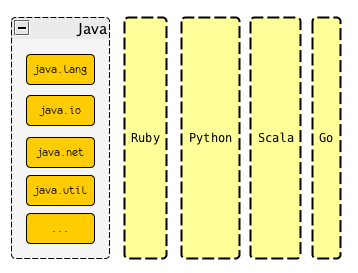
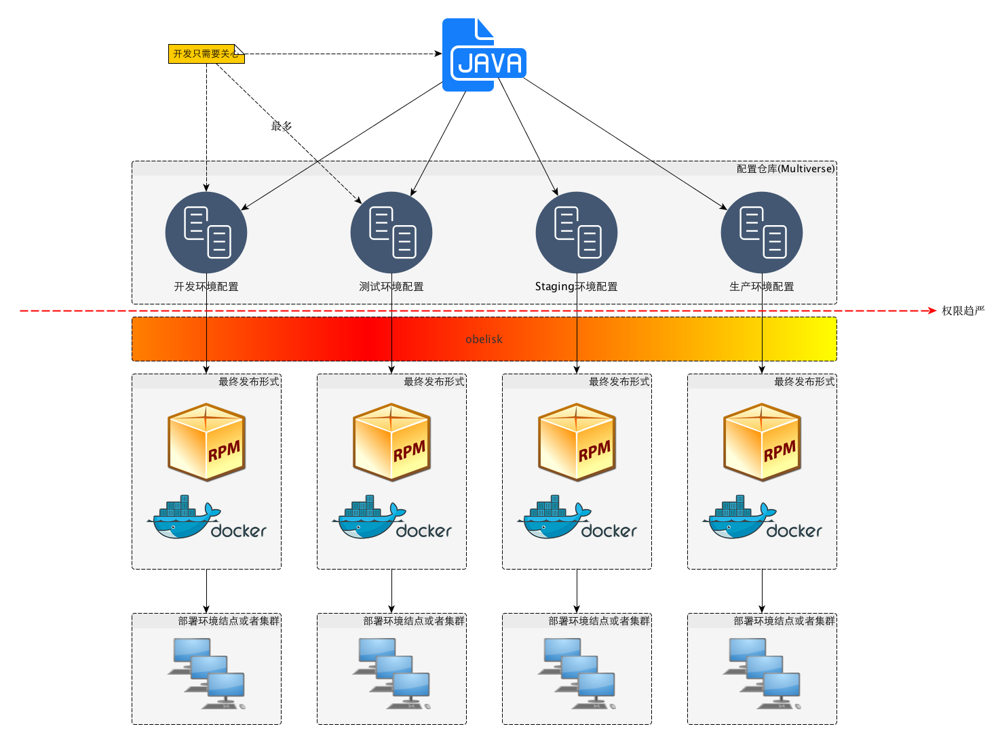

% 高效写作的秘密 - 扶墙老师的写作工具集
% 王福强 - fujohnwang AT gmail DOTA com
% 2015-08-15

看到[我在Mac上的写作工具链](http://mp.weixin.qq.com/s?__biz=MjM5MzIwMzExMg==&mid=222341648&idx=1&sn=1a6c4c69e57194153080050b352b8d2e&scene=5#rd)， 有感于很多工具和思路的相似， 遂决定也晒一下自己的写作工具集， here we go...

我没有使用Latex系列的经验(虽然当年尝试学习了解过这科学系写作装逼神器)， 但是哥当年也却使用过另一写作系的业界规范 - [DocBook](http://www.docbook.org/)， 而且使用docbook写过一本书，即[《Spring揭秘》](http://product.china-pub.com/195969)， 且在docbook的基础上打造了相应的工具链支持，比如这个项目<https://github.com/fujohnwang/docworks-with-docbook>， 而且当年扶墙老师使用svn做了版本控制， 只可惜不知道什么时点， 或许是换机器，或许是手贱格式化硬盘重装系统，总之，手稿丢失了 :(， 在磁性截至如此不安全的前提下， 各位看官还是吸取扶墙老师的教训，多搞点儿备份，多用用云吧！

使用docbook写稿并跟出版社打交道交稿子，校验稿子这样的做法是无法施行的， 所以， 扶墙老师也遇到了跟上面那篇文章作者同样的经历， 即最终将稿件转为word文档，然后在word文档基础上跟出版社编辑你来我往的一次次校验，并最终出版， 哥得说，那不是一段“赏心悦目”的历程...

n年之后， 扶墙老师另觅新欢了， "md"， 当时很抵触的东西，一旦使用之后就欲罢不能了。

为了写Markdown，扶墙老师辗转反侧，最终选定了[Mou](http://25.io/mou/)作为编辑器，并且也donate了多次， 但是， 不知道是不是断网情况下还是都会这样， Mou在保存的时候经常“转菊花”， 对于我这种习惯性`Cmd + S`d的深度用户， 这种情况是无法忍受的，因为会打断写作思路， 所以，扶墙老师暂时先用[MacDown](http://macdown.uranusjr.com/)这个编辑器过度下（其实也完全满足需求了）， 待Mou出了1.0之后再转回去： 

以上两种Markdown编辑器都有相应的Preview预览， 而且也允许你提供自定义的CSS来定制页面的渲染效果， 如果你用Markdown来写邮件，那么， 可以写完后直接拷贝预览的文本作为邮件正文就可以发送一封结构清晰，效果优美的邮件啦~

对于扶墙老师来说， 使用Markdown要写的东西很多，不单单限于邮件啦这种短文本， 而且，默认的markdown规范规定的文本结构有一定的限制，所以，扶墙老师除了使用markdown格式来写作，还需要[pandoc](http://pandoc.org/)这个小而精美的命令行工具来进一步“扩大战果”。

pandoc有扩展的markdown语法，比如superscript, subscript, inline footnote等等， 但最赞的，其实是可以自动生成toc（即文本大纲）， 以及各种各样的输出格式，包括但不限于html， pdf， epub等， 瞧， 下面这篇周报就是使用markdown编写并使用pandoc进行转换而得来的：

还有哦， [扶墙老师的个人博客](http://afoo.me)也完全是基于markdown + pandoc静态生成的那~

俗话说，"一图胜千言(A picture is better than a thousand words)"，写作的时候为了生动形象的表意， 通常会插入一些图片啦， 示意图啦之类， 扶墙老师通常使用[yEd](https://www.yworks.com/en/products/yfiles/yed/)来勾画并创作相应的架构图或者示意图， 之前也尝试过Keynote或者OmniGraffle之类， 但徘徊了很久之后，最终下定决心，好好打磨一些yEd，并最终坚持了下来， 实际上， 工具是次要的， 使用工具的人才是主要的，哈哈， 瞧， 从最早画一些黄不拉几的示意图，到现在清新可人的架构图， 扶墙老师的yEd之旅跃然呈现：

在使用yEd构思示意图的时候，唯一不太好搞的就是UML里的sequence图， 虽然勉强可以画，但效率实在不高， 所以， 寻摸来寻摸去，扶墙老师最终选择定了[PlantUML](http://plantuml.com/)， 当然，之前也使用过online的类似工具比如像这个<https://www.websequencediagrams.com/>，但提示你升级或者购买服务挺烦的，而且， 效果其实就是plantuml的效果，所以， 直接使用plantuml就一了百了了。

plantuml也是一个Transformer， 我们通过特定的语法编写sequence图的文本，然后通过plantuml进行转换，就可以得到相应的sequence图输出了，比如，如下plantuml的sequence图定义文本：

~~~
@startuml
Alice -> Bob: Authentication Request
Bob --> Alice: Authentication Response

Alice -> Bob: Another authentication Request
Alice <-- Bob: another authentication Response
@enduml
~~~

经过plantuml转换之后， 就可以得到如下效果的sequence图：

而且我们还可以定义不同的输出风格， 更多特性可以参考<http://plantuml.com/sequence.html>

最后提一句， 开篇的文字中提到了Graphviz， 这个东西嘛，其实也挺好，都是使用特定语法的文本来定义（便于编辑，进行版本控制以及对比等）， 然后通过转换获得相应的示意图输出， 不过，我倒是建议，除非是特别适合程序输出的相对固定规则的示意图，否则给人看的，还是yEd人工创作的用户体验更好一些。 但yEd和Graphviz两者并不冲突， 如果我们使用Graphviz和特定程序构建了一个特别复杂的图，其实可以将其输出为graphml格式的文件，然后通过yEd打开，哗啦，格式互通万岁~

以上就是扶墙老师写作的秘密，

的一小部分， 如果你想知道更多， 可以来[挖财](http://www.wacai.com)找我，哈哈

