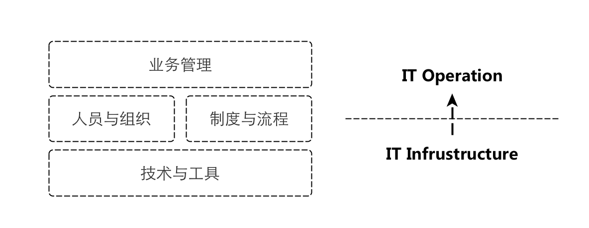

% 华东互联网+技术峰会回顾
% 陨石 - yunshi AT wacai DOTA com
% 2015-09-21

> 以下文字为扶墙老师一家之言，权作参考，扶墙老师在运维方面属于菜鸟级别 ;)

# 本期峰会Word Cloud

# 运维发展方向

## 视角与维度一

1. 运维1.0 - 监控
2. 运维2.0 - 工具化和自动化
3. 运维3.0 - 动态变更（比如阿里的单元化 ^[什么是单元化？扶墙老师的理解是， 以功能或者服务维度对支撑这个粒度的软件服务所需要的硬件资源等进行归并划分， 联动调度， 每个功能或者服务可以按需被部署和调度到指定的硬件资源单元边界内，即做到了资源的动态调度和变更， `服务(Software) <-> 单元(Hardware)`]）

## 视角与维度二

1. Tooling & Automation（工具化和自动化）
2. Private Cloud （构建私有云）
	- 所谓云计算，即ITIL + CMDB + Automation
3. DCOS 

## 视角与维度三

1. 运维自助化， 自动化
2. 场景自动化
3. 智能化（数据驱动动态变更？）

# 运维组织的建设与发展

# 运维之道

**运维职能减少人为事故，但无法完全避免！！！**

**边界的权衡**， 比如内外网与否

> 三分基础设施建设， 七分运维体系建设

`原子件 + 复合件`的思想延伸

## 制度与流程

### 运维流程实践一

作业通告 -> 确认单(Checklist) -> 操作（人） -> 检查（人）

### 软件交付链路实践与理念

`交付点 -> 应用编排上线运行 -> 托付` from DaoClound

> NOTE
> 
> 实际上，单元化也好， 透明化也罢，本质上是看你对不同粒度资源的动态调配能力。

### 入职考察

腾讯现在运维人员入职都要进行上岗考试， 通过了才可以上岗， 另外，他们入职都要进行血泪史的破冰。

# 运维之术

可视化(一图胜千言）

`服务目录管理入口`与`上帝节点`

服务注册与发现

## 容灾预案

1. IDC粒度
2. 单元粒度， eg. 异地多活
3. 网络层面
4. ...

## 统一路由管理（阿里的案例）

覆盖如下层面， 20秒最快更新

1. 统一接入层（nginx）
2. RPC框架
3. 异步消息
4. 数据层

## 网络基础数据

1. IDC机房内(Intra-IDC)， 0.2ms
2. 城域网内（跨机房）(Intra-City)， 1ms
3. 跨城（Inter-City）， 10ms ~ 100ms

# 产业链

## 硬件

1. DELL VS. Inspur(浪潮) 
	- 服务器市场
2. H3C
	- 网络设备 ^[交换机类型： 1. 核心交换机；2. 汇聚交换机； 3. 接入交换机]

## CDN市场

0. 脉创
1. 阿里云
2. 腾讯云
3. 七牛
4. upyun
5. 蓝汛
6. 迅雷
7. ...

# 运维血泪史案例分享

1. 交付的裸服务器被种木马 （腾讯游戏）
	- 做好上线检查
2. RAID卡电池充放电禁止cache导致服务器变慢
	- 推迟充放电时间点（因为无法禁止）
3. 可以加上我们自己最近一次发生的机房内光纤故障

# 术语

1. TCO = Total Cost of Ownership， 总所有成本
2. Cloud Cube Model
3. ITIL = IT服务管理规范，只是概念
4. ITSM = IT Service Management， IT服务治理

