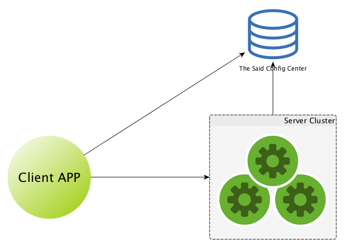
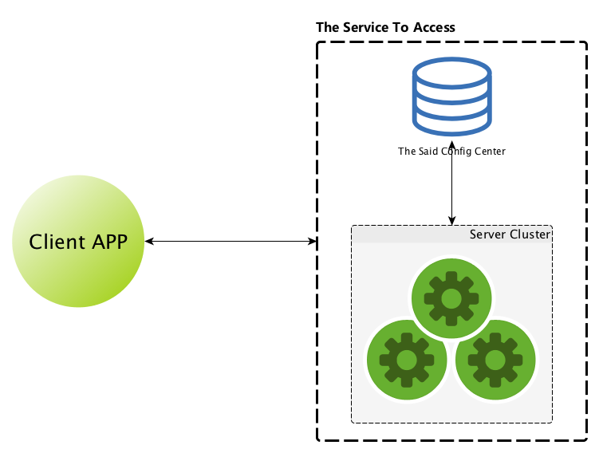

% 技术人也需要有产品思维(why techies also need think the PD way)
% 王福强 - fujohnwang AT gmail DOTA com
% 2015-11-10


有人说， 在一个老板是产品出身的公司里， 大家自然而然的会更加关注产品，所以， 既然有很多人已经在关注产品了，那么我选择扑在技术上，帮助把支撑的根基夯实。 不过这并不表示我不关注产品， 实际上， 只要你有心， 产品思维可以帮助你把事情做得更好，落地更平滑。 

什么是产品思维？ 不管是哪种“大家”， 其拥有的综合能力一定都是比较强的， 好的产品经理也不例外， 我不专职PD， 也不想班门弄斧，我只想跟大家先强调一点， `尝试去多关注一下用户体验`， **UX Matters!**

下面是扶墙老师乐意跟大家分享的几个案例场景，粒度由小到大，希望大家喜欢并有所启发 ;)


# 名字， 很重要(What's In A Name?)

新建一个项目之前，开发一款新产品之前， 创立一家新公司之前， 最头疼的事情是什么？ 对， 起名字！

一个好的名字，绝对可以后期省掉你很多的事情，尤其是省钱 ；）

君不见，一个好的域名值多少银子？ 为啥？因为人家值啊， 搞一个贼jb长的名字，你就得砸一堆的银子去做营销， 这些银子，其实就是一个好域名的价值体现；

名字起的好， 用户记得牢，更容易被接受，从而也就更容易推广。


很多时候，我们在起名字的时候都仅仅是站在自己的角度去想，但其实对于这些名字的受众来说， 却是一种糟糕的体验。

扶墙老师是一个很有情怀的人， 尤其是对marvel的文化很推崇，所以， 就希望给公司里很多技术项目起一些marvel相关的名字，比如obelisk, avengers, multiverse， 但是， 说实话，从用户体验角度来看，其实是在下输了, 试问， 诸君看了这几个名字知道是啥意思不？ 进而知道名字背后代表的项目是做啥用的不？ 基本不知道吧，哈哈

1. obelisk其实是我们挖财的一键部署平台项目；
2. avengers是挖财内部一些通用的元数据管理项目；
3. mutiverse是挖财内部配合obelisk一起工作的配置中心项目；

没想到吧？ 所以说是在下输了，情怀这东西是要有，但不能当饭吃， 该内秀的就别动不动外漏了 ;)

> 为了强化obelisk这个名字， 我需要每周的周报中以`obelisk(一键部署平台)`这样的形式来写周报， 这tmd都是成本啊~~~

# 你真的会写邮件吗？(Mail Wisely)

大家都写过邮件吧？ 写得好吗？ 其实，邮件写的好不好，做做对比就知道了。

周报大家应该都发的吧？ 有的周报是以excel格式收集汇总并以附件形式发出来的， 有的周报则直接在邮件正文中直接显示， 那各位看官觉得哪一种方式更好那？ 还是无所谓？

实际上， 从用户体验角度考虑， 后者要更好一些。 发送邮件的目的， 是希望邮件的接受者可以收到并阅读， 如果你是邮件的阅读者，你希望点开邮件就可以直接阅读，还是点开邮件再点开附件再进行阅读？答案不需要我说了吧？

不光是正文， 对于邮件标题来说也需要考究的设计。

如果邮件列表中都是千篇一律的`周报`或者`发布公告`之类很普遍的信息， 邮件接收者很难从这个列表中选择出他/她希望关注的邮件，可是如果我加上一些很特定的或者特异性的信息，设计成`xxx的周报`或者`xxx项目发布公告`形式的邮件标题，那么，就可以让邮件接收者很容的从邮件列表中捕捉到明确的邮件了。


# API设计也需要考虑用户体验(The Way Of API Design)

遥想当年（大约2004年或者2005年左右）， 扶墙老师还在大连英极奋发图强， 曾经苦口婆心，怒发冲冠的跟“白袜子”同学讨论他写的XXClient，设计多么烂，多么不好用，应该参考一下Spring框架里Template模式的使用，云云

可是，今天， 扶墙老师却踩入了同样的一个坑儿里...

作为一个技术人，最自然的行为会去考虑如何实现功能，比如一个XXClient， 我们会很自然认为，先要有如何连接，如何通信，如何关闭等功能实现，然后自然而然的，这些功能实现的想法又会反映到我们提供给用户的API上（当然，这里的用户是使用你的XXClient的开发者），从而设计出如下类似的API接口：

```java
public interface XXClient{
	public void connect() throws IOException;
	
	public String upload(File payload) throws IOException;
	
	public void close() throws IOException;
}
```

可是作为API的使用者来说， 他最关心的是什么？ 他最关心的其实就一个功能：

```java
public interface XXClientLite {
	public String upload(File payload) throws IOException;
}

// client.upload(file);
```

至于你如何复杂，如何牛B的实现这个接口， 其实用户真不那么关心！

道理其实很简单， 列位估计也已经对扶墙老师就这么弱的问题还blablabla说个不停嗤之以鼻了吧？ 

螺旋上升之路有些时候是曲折的，比如10年后，扶墙老师在这个层面上败给了"当年的那个愤青"...

为了更好的推广Web API的规范， 扶墙老师写了一个webapi的library用于简化Web API的开发，开发者只要maven里依赖一下就可以写写SpringMVC的Controller， 从而自动享受到Web API文档的支持，享受到返回遵循挖财web api规范的Json格式响应， 享受到统一的异常处理， 但是， 也许是扶墙老师‘利欲熏心’，太要强于推广web api规范落地了，所以，硬生生的要求通过强类型的约束来编写Controller:


```java
@RequestMapping(value = "/api/v1.1/{endpoint}", method = RequestMethod.GET)
public WebApiResponse<String> endpointApi2(@PathVariable("endpoint") String endpoint) {
   return WebApiResponse.success("just test payload");
}

```

即使是到这一步，我们也演化了很久，但实际上我们却忽略了最基本的用户体验， 对于一般的应用开发者来说，他们希望的其实就是， 直接返回相应的值对象(Value Object)类型，而不是通过WebApiResponse封装的类型， 你框架背后怎么把这些结果转化为符合web api规范的json响应，我干嘛要关心？

```java
@RequestMapping(value = "/api/v1.1/{endpoint}", method = RequestMethod.GET)
public ValueObject endpointApi(@PathVariable("endpoint") String endpoint) {
   return new ValueObject();
}
```

恍然一惊之后， 才发现原来之前太过于执着规范的落地了， 太过于从自己出发，反而这样简单的API设计道理都忘记了， ：（

遂痛改前非，稍作coding， 让以上两种形式都可以工作。 

啥？ 为啥还留着之前的形式？ 亲， 之前签订的条约你要遵守的啦， 单方面撕毁条约你要承担后果的哦~

所以，API设计绝不简单， 设计完了， 尝试自己作为API的使用者先用用，并且让周边的人也都用用， 觉得没有太大的抱怨了，再放出去， 因为这就跟泼出去的水一样，API一旦放出去，就没有那么容易收回来了。 宁可前期少开放功能，也不要一上来开放所有功能， 不够，可以后面再加； 但放多了， 就收不回来了， 切记


# 技术产品同样需要考虑用户体验(Tech Product Design In A Better Way)

小到一个API的设计，大到一个技术产品，比如中间件或者软件平台，在设计的时候都需要考虑用户体验，否则，用户就会苦不堪言甚至怨声载道，从而影响到你的技术产品的推广和引入。

用户的抱怨是良药，应该成为各位技术产品打造者的推动力。

很多技术人员以技术的高深境界来评判和选择一个技术产品， 唯技高者🐴首是瞻， 从而盲目的选型，进而把本可以避免的问题又再一次从其它机构引入到自己内部来，并沾沾自喜， 不信？ 各位看官开眼啦~

TAO系在技术业界是名声在外的，但不意味着他们所有的技术和产品都是最好的，考虑最系统的，设计最合理的。 以配置中心Diamond为例，这个东西对所有的分布式系统是必须的吗？ 我认为不一定。

这里的配置中心的概念，扶墙老师也不认为是配置中心， 倒是称作状态中心更为贴切， 实际上， 这个东西完全被当做了一个共享状态使用了， 一个客户端和服务器端共享的状态中心， 而这个共享状态中心的本质目的就是实现双方的消息交互！ 



可是，为了达到这个目的，就一定要烦恼你的客户端用户嘛？ 我为什么既要知道你这个状态中心在哪儿，并且怎么通信，还要知道你服务器在哪儿，怎么通信？ 你扩容了，我还得知道并调整自己的工作状态？

拜托，那tmd都是你们家里（serverside）的家务事，干嘛来烦我？ 我要的只是，给我你的地址，有事儿我只找你一个，不是吗？



这时候有人要说了，你这样不就引入更多roundtrip了嘛，这多影响性能啊？ 拜托， 对于你的用户来说，`关我啥事儿？`，那是你服务提供者（service implementor）要考虑的事情！ (你要么inline服务节点，要么提高网络基础设施的服务能力， 但这些都与用户无关）

帮助用户（client app）屏蔽掉复杂度， 也就节省了用户的心智，小白都能配置一个你的服务地址调用服务了，何来一堆复杂的配置要去搞懂那？ 这样容易配置使用的产品会没有人愿意用？

> 当然，我相信所谓的配置中心也有其存在的合理性，就是糙快猛的先上，满足业务上线的需求， 或者做应用出身的开发者，会很自然的想到如此实现， 但扶墙老师认为，在技术产品的设计上，这不是一个好的设计。
> 
> 艹，貌似我当年写 <https://github.com/alibaba/cobarclient> 也犯了同样的毛病。


# 一刀切还是个性化？(Consistency Or Specificity?)

近来发现一个现象， 做视觉的同学会倾向于只出一版基于iOS的视觉稿，然后让Android和iOS研发都遵循这一套iOS视觉稿进行实现， 那么， 问题来了， 这样做合适嘛？

如果从设计师的角度来说，太合适了，看着就是美， 美，美； 但是如果从用户体验角度来讲，则不尽然了。

一个问题是， Android UI系统跟iOS完全是不一样的思路和设计， 为了能够做到iOS的效果，Android研发的同学可能要做更多的工作，获得的效果可能还很蹩脚。 如果加上交互的因素，那就更说不过去了。 iOS的操作习惯和Android的操作习惯完全不一样， 完全按照iOS去设计交互，对Android用户来说就很蹩脚， 不信你试试！

扶墙老师提倡一个原则： `抽象共性，实现个性`， 我们可以某种程度上求同， 但落实的时候则需要存异，要工作到位， 这个时候就是应该具体情况具体分析！ 

# 后话

扶墙老师以身示范自黑， 不知各位看官以上这些小故事读得爽吗？

其实就是考验各位的换位思考能力以及实践检验"你的真理"的能力， 只要别换来换去把自己整疯了就行，哈哈哈

> 严重声明： 扶墙老师不是在贬低技术人， 偶也是做技术的， 但如果我们做技术的都能够多少关注一下用户的体验和感受，那么技术将发挥更大的作用和价值！！！


# References

1. [马化腾的“邮件癖”](http://mp.weixin.qq.com/s?__biz=MzA3ODQ1NjYyOQ==&mid=400704277&idx=1&sn=3c089e3f4df3905fac1d6e064c482b70&scene=1&srcid=1110on3B66ym8DlWmarMDaqs&from=groupmessage&isappinstalled=0#wechat_redirect)
2. [实施微服务需要哪些基础框架](http://mp.weixin.qq.com/s?__biz=MjM5MDE0Mjc4MA==&mid=400645575&idx=1&sn=da55d75db55117046c520de88dde1123&scene=2&srcid=1109XAQ6ZhXGRe6trz3blGJb&from=timeline&isappinstalled=0#rd)
3. 推荐书目： 《像外行一样思考，像专家一样实践》

