% Gitlab OAuth2 Application简明教程
% 王福强 - fujohnwang AT gmail DOTA com
% 2015-12-17


aka. **A simple guide on how to create a Gitlab OAuth2 Application**

# 概要流程说明

## 应用注册

Gitlab允许用户创建Applications， 这些Applications可以通过OAuth2授权来访问Gitlab的相应资源。

在Gitlab中， Applications分两种, 第一种是用户级别的Application， 这一般通过用户的Profile菜单进入创建：

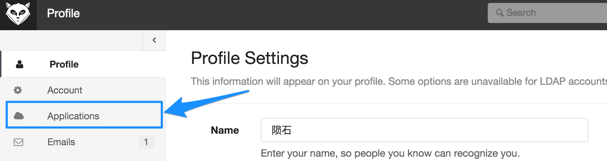

第二种是系统级别的Application， 这一般只有管理员权限的人通过Admin菜单进入创建:

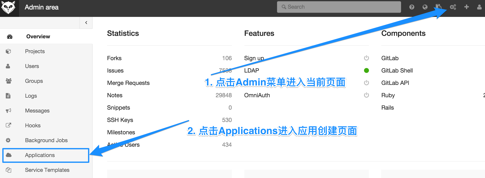

我们以系统级别的Application为例， 说明如何创建并注册一个Application：

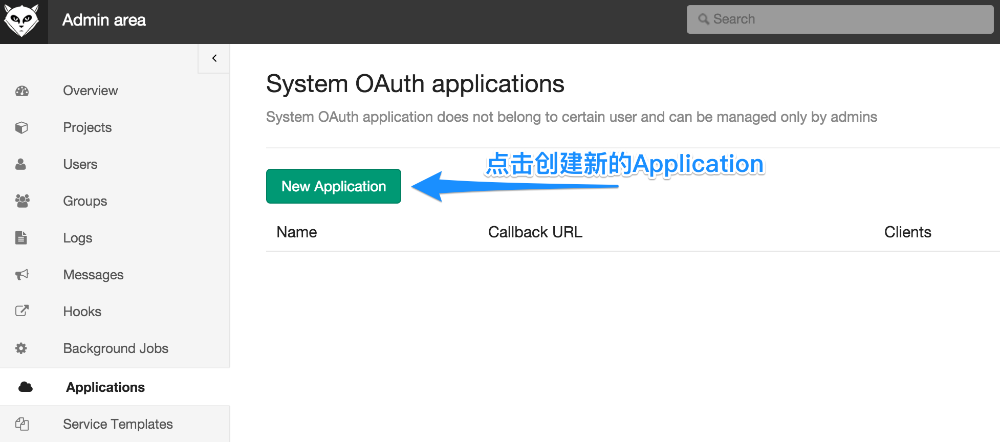

点击"New Application"之后， 会进入要求输入应用注册信息页面：

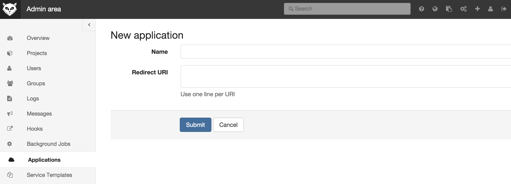

假设我们创建一个testapp应用，并在本机调试，那么我们填写如下信息：

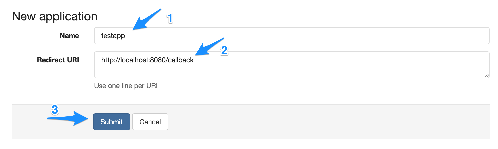

然后点击提交(Submit)， 将得到应用创建后的信息：

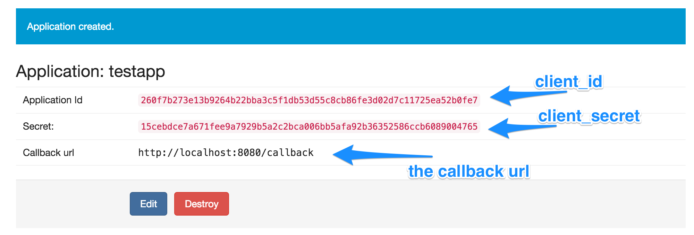

> 这个页面的信息将由创建应用的管理员分发给相应的Application负责人， 后面， Application应用负责人将使用这些信息做认证。

注册完成后， 我们可以看到应用现在只有0个Clients， 即还没有任何实例作为这个Application的实例进行认证：

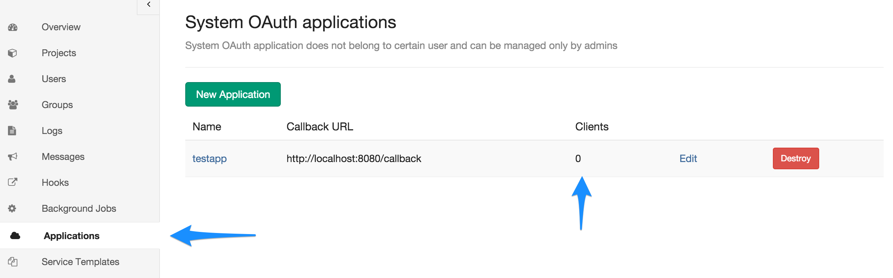

但不管怎么说， 应用注册这一步我们算成功完成啦！ Give Me Five~

## 应用授权

应用注册成功后， 应用的实例就可以作为一个认证实体向Gitlab认证自己啦， 如果认证成功， 就可以获取一个代表某个用户权限的access token对Gitlab的资源进行访问了。

[GitLab as an OAuth2 client](http://doc.gitlab.com/ce/api/oauth2.html)这篇帮助文档其实说的就是这个过程， 但其实只是看， 不自己动动手很难搞清楚这个过程是怎么回事， 尤其是， 帮助文档中没有清楚的表达出Gitlab和Application实例双方的交互流程，初看起来更是让人百思不得其解。

下面我简单通过图例说明这个交互的过程，后面再通过工程实例代码演示这个过程是如何实现的...

首先， 我们需要创建一个Web应用， 这个Web应用就是我们注册为Gitlab上的那个Application， 当用户初次访问这个Application的时候（比如访问http://your.application.host/)， 我们需要获得Gitlab上某个用户的授权，以便代表这个用户来访问Gitlab上的资源并做一些事情， 所以，我们直接将用户请求redirect到gitlab的某个url下， 这个url就是`http://{your.gitlab.server}/oauth/authorize`， 当然， 我们需要通过参数带上一些必要的请求信息，以便gitlab可以决定给谁授权， 所以， 这个url后面一般需要带上以下几个参数：

1. **client_id**， 也就是我们注册Application成功后分发给你这个Application的**Application Id**;
2. **redirect_uri**, 在注册Application的时候我们自己提交的Callback url， 因为我们在本地调试， 所以其实就是`http://localhost:8080/callback`这个url， 如果是线上应用，一般直接在注册的时候（或者之后Edit）输入对应的域名标识的url；
3. `response_type=code`, 固定字符串， 表示我们使用OAuth2的`Authorization Code Grant`授权模式；

当请求被重定向到以上gitlab的url的时候， gitlab会显示如下类似的页面要求当前已经登录gitlab的用户授权当前Application代表他/她来访问Gitlab的各项资源：

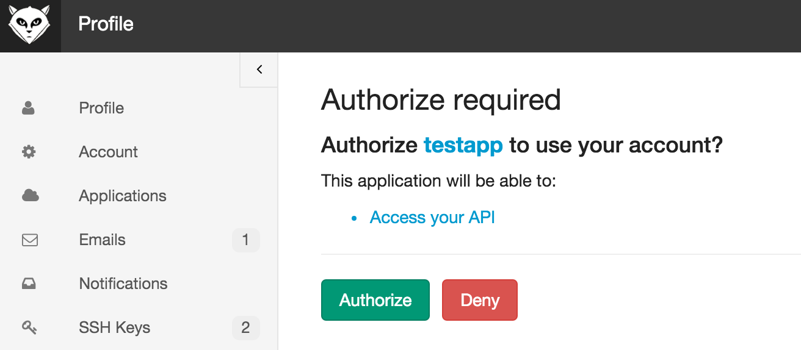

不管用户是点击了"Authorize"同意授权还是“Deny”拒绝授权， gitlab都会将web请求重定向到Application注册的时候提供的Callback url地址上（在这里是我们的`http://localhost:8080/callback`）， 然后Application的对应这个url地址的Action就可以根据授权结果来决定后继行为了。

如果用户授权， 则Application会收到一个授权code， 使用这个授权code结合之前分配的Secret（即client secret）和一些其它必要信息，就可以访问`http://{your.gitlab.server}/oauth/token`并从请求返回的响应(Response)中获得一个AccessToken(当然，还有其他信息，比如Expire时间窗口有多长， RefreshToken，以及授权访问的scope是什么等）， 之后， Application就可以使用这个AccessToken并结合gitlab的API来访问相应的资源（只要授权的这个用户有权限访问）。


# 工程实现举例

我们使用Apache的OLTU这个库来构建OAuth2交互流程，所以需要先把它加到项目依赖之中：

```xml
	<dependency>
		<groupId>org.apache.oltu.oauth2</groupId>
		<artifactId>org.apache.oltu.oauth2.client</artifactId>
		<version>1.0.1</version>
	</dependency>
```

简单起见，我们使用SpringBoot构建一个Web应用oauth2-app-proto， 项目的POM大体看起来像这样：


```xml
<?xml version="1.0" encoding="UTF-8"?>
<project xmlns="http://maven.apache.org/POM/4.0.0" xmlns:xsi="http://www.w3.org/2001/XMLSchema-instance"
	xsi:schemaLocation="http://maven.apache.org/POM/4.0.0 http://maven.apache.org/xsd/maven-4.0.0.xsd">
	<modelVersion>4.0.0</modelVersion>

	<groupId>com.keevol</groupId>
	<artifactId>oauth2-app-proto</artifactId>
	<version>0.0.1-SNAPSHOT</version>
	<packaging>jar</packaging>

	<name>oauth2-app-proto</name>
	<description>Demo project for Spring Boot</description>

	<parent>
		<groupId>org.springframework.boot</groupId>
		<artifactId>spring-boot-starter-parent</artifactId>
		<version>1.3.0.RELEASE</version>
		<relativePath/> <!-- lookup parent from repository -->
	</parent>

	<properties>
		<project.build.sourceEncoding>UTF-8</project.build.sourceEncoding>
		<java.version>1.8</java.version>
	</properties>

	<dependencies>
		<dependency>
			<groupId>org.springframework.boot</groupId>
			<artifactId>spring-boot-starter-web</artifactId>
		</dependency>
		<dependency>
			<groupId>org.apache.oltu.oauth2</groupId>
			<artifactId>org.apache.oltu.oauth2.client</artifactId>
			<version>1.0.1</version>
		</dependency>
	</dependencies>
	
	<build>
		<plugins>
			<plugin>
				<groupId>org.springframework.boot</groupId>
				<artifactId>spring-boot-maven-plugin</artifactId>
			</plugin>
		</plugins>
	</build>

</project>

```

我们核心类就一个:


```java
@Controller
public class IndexController {
    protected transient final Logger logger = LoggerFactory.getLogger(getClass());

    @Value("${oauth2.server.url}")
    private String gitlabServerUrl;
    @Value("${oauth2.server.url.authorize.path:/oauth/authorize}")
    private String authorizePath;
    @Value("${oauth2.server.url.token.path:/oauth/token}")
    private String tokenPath;

    @Value("${oauth2.client.id:260f7b273e13b9264b22bba3c5f1db53d55c8cb86fe3d02d7c11725ea52b0fe7}")
    private String clientId;
    @Value("${oauth2.client.secret:15cebdce7a671fee9a7929b5a2c2bca006bb5afa92b36352586ccb6089004765}")
    private String clientSecret;
    @Value("${oauth2.client.callback.url:http://localhost:8080/callback}")
    private String callbackUrl;

    @Autowired
    TokenRepository tokenRepository;

    OAuthClient oAuthClient = new OAuthClient(new URLConnectionClient());

    String currentUserMock = "yunshi";

    @PreDestroy
    public void cleanUp() {
        oAuthClient.shutdown();
    }

    @RequestMapping("/main")
    @ResponseBody
    public String main() {
        if (tokenRepository.getTokenOf(currentUserMock).isPresent()) {
            return "authorization is done, you are good to go with access token: " + tokenRepository.getTokenOf(currentUserMock).get();
        } else {
            return "no authority.";
        }
    }

    @RequestMapping("/")
    public String index(HttpServletRequest req, HttpServletResponse response) throws Throwable {
        if (tokenRepository.getTokenOf(currentUserMock).isPresent()) {
            logger.info("query user information with access token...");
            OAuthClientRequest bearerClientRequest = new OAuthBearerClientRequest(gitlabServerUrl + "/api/v3/user").setAccessToken(tokenRepository.getTokenOf(currentUserMock).get()).buildQueryMessage();
            OAuthResourceResponse resourceResponse = oAuthClient.resource(bearerClientRequest, OAuth.HttpMethod.GET, OAuthResourceResponse.class);
            logger.info("had authorized, just query for user information...");
            logger.info("user information: " + resourceResponse.getBody());
            return "redirect:/main";
        } else {
            logger.info("first login, build oauth request >..");
            OAuthClientRequest request = OAuthClientRequest
                    .authorizationLocation(gitlabServerUrl + authorizePath)
                    .setClientId(clientId)
                    .setRedirectURI(callbackUrl)
                    .setResponseType("code")
                    .buildQueryMessage();

            String gitlabAuthUrl = request.getLocationUri();

            logger.info("redirect to : " + gitlabAuthUrl);
            return "redirect:" + gitlabAuthUrl;
        }
    }


    @RequestMapping("/callback")
    public String callback(@RequestParam(value = "code", required = false) String code,
                           @RequestParam(value = "error", required = false) String error,
                           @RequestParam(value = "error_description", required = false) String errorDescription) throws Throwable {

        if (StringUtils.hasLength(error)) {
            logger.error("authorization fails with error={} and error description={}", error, errorDescription);
        } else {
            logger.info("callback request receives with code={}", code);

            OAuthClientRequest request = OAuthClientRequest
                    .tokenLocation(gitlabServerUrl + tokenPath)
                    .setGrantType(GrantType.AUTHORIZATION_CODE)
                    .setClientId(clientId)
                    .setClientSecret(clientSecret)
                    .setRedirectURI(callbackUrl)
                    .setGrantType(GrantType.AUTHORIZATION_CODE)
                    .setCode(code)
                    .buildQueryMessage();

            logger.info("build authorize request with code:{} and client secret", code);

            OAuthJSONAccessTokenResponse response = oAuthClient.accessToken(request);
            String accessToken = response.getAccessToken();
            logger.info("access token got: {}", accessToken);

            // save access token for further use, then redirect user to another url in our own application.
            tokenRepository.store(currentUserMock, accessToken);
        }

        return "redirect:/main";
    }
    // ...
}
```

首先重点关注映射处理根路径请求的index()方法，这个endpoint负责触发授权行为， 你会看到，如果我们发现当前用户在我们应用这边没有任何授权状态（比如没有相应的access token）， 那么，代码逻辑走else分支， 我们将构建一个要求gitlab服务器授权的请求，并将当前针对我们自己应用的web请求重定向到gitlab服务器的授权地址， 之后你就会看到以下的页面：


gitlab的当前登录用户如果点击`Authorize`同意授权之后， gitlab将会传递一个授权code给应用注册时候提供的callback地址， 这样， 请求就会轮转重定向到这个callback地址， 这个callback地址，在我们的Controller实现中是对应`callback()`这个endpoint方法进行处理的。

> 如果用户点击`Deny`拒绝授权， 请求也同样会重定向到callback地址，只不过传递的参数不是一个授权code， 而是一个error和error_description， 所以，你会看到我们的callback()方法声明了三个非必须的参数。
> 
> 未授权的处理很简单，重定向到应用的某个公开页面就可以了，这里不再细说。

应用的callback()处理方法收到授权code之后， 会使用这个授权code加上应用注册时候配发的相应clientId和clientSecret等信息构建一个请求access token的oauth2请求，并发往gitlab服务器， 即这一段代码:

```java
            OAuthClientRequest request = OAuthClientRequest
                    .tokenLocation(gitlabServerUrl + tokenPath)
                    .setGrantType(GrantType.AUTHORIZATION_CODE)
                    .setClientId(clientId)
                    .setClientSecret(clientSecret)
                    .setRedirectURI(callbackUrl)
                    .setGrantType(GrantType.AUTHORIZATION_CODE)
                    .setCode(code)
                    .buildQueryMessage();

            logger.info("build authorize request with code:{} and client secret", code);

            OAuthJSONAccessTokenResponse response = oAuthClient.accessToken(request);
```

请求成功之后，我们就可以获得相应的access token（以及对应refresh token， expires时间等）， 之后，我们就可以使用这个access token畅通无阻的访问授权用户的各项gitlab服务器上的资源了 ^[比如在index()方法中，如果我们发现当前用户是已经授权成功的用户，则可以直接使用他/她对应的access token结合gitlab API来访问他/她的个人信息以及一系列资源]。 

我们的代码实例中，只是先存下来，然后将用户引导到一个无关的展示页面（`/main`）， 在实际应用中，可以考虑直接将用户引导到授权之后有权限访问的页面。

到此， 基本上一个与Gitlab服务器正常交互的OAuth2处理流程就完成啦！

如果你再次去查看gitlab服务器上Application的列表， 会发现我们注册的Application已经有1个Clients啦:

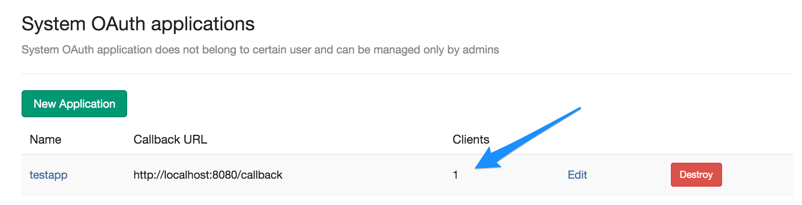

有咩有一点儿小兴奋？ ^_-

# FAQs

## Private Token与Access Token什么区别？

通过OAuth获得的是Access Token，Access Token一般代替当前给与授权的用户颁发给应用实体，拿到Access Token之后， 可以依据Access Token去获取用户信息，进而可以在用户信息中拿到用户个人的Private Token。

不管是Access Token还是Private Token， Gitlab API都支持作为API访问的凭据。

在gitlab中， 颁发的access token一般是长度为64的字符串， 比如`1f0af717251950dbd4d73154fdf0a474a5c5119adad999683f5b450c460726aa `， 而private token则只是长度20的字符串， 比如`SegfaScazyYyD_UG-n68`

> Gitlab用户如果没有登录的话， 授权其实是不会进行的， gitlab会引导用户到登陆页面登录， 只有登录成功的用户才会授权oauth2客户端应用访问。


## "The redirect url included is not valid"错误

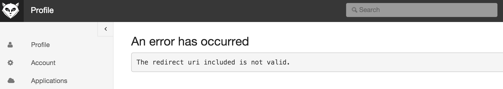

一般情况下， 出现这种错误信息是因为应用注册的时候提供的callback地址跟我们在发起授权请求时候提供的callback地址不一致， 比如我们在注册的时候提供callback地址为`http://localhost:8080`，而在发起授权请求时提供的callback地址却是`http://localhost:8080/callback`。


## 为啥没有显示授权页面，而是引导我到了登录页面？


如果当前机器上无任何用户登录gitlab，当gitlab收到要求授权的请求时（即接收到重定向到`http://your.gitlab.server/oauth/authorize`的请求）， gitlab会再次将请求重定向到gitlab的登录页面, 要求使用Application的用户登录Gitlab从而可以作为一个主体授权Application访问:

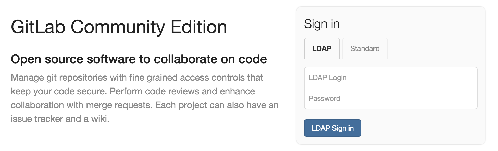

用户成功登陆后，则被gitlab引导进入Dashboard页面：

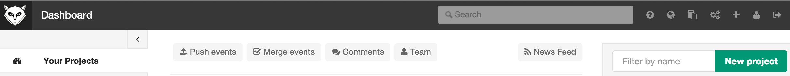

这里有点儿不够友好， 需要用户重新访问要求授权的Application的某个URL以便重新发起授权请求。


# 小结和补充

使用Controller来演示通过OAuth2与Gitlab服务器交互实际上只是为了简化， 正常来说， 使用拦截器或者Filter来管理授权行为的触发和认证才是比较合适的做法，尤其是封装成一个spring-boot-starter-gitlab-oauth2之类的自动配置模块， 可以大大简化开发的复杂度提升集成效率， 也不需要应用研发用户去了解以上流程交互细节（当然啦，从研发人员的角度， 还是了解这些细节比较好）。

授权成功后，我们其实可以拿到不止一个Access Token， 随同的还有Refresh Token, Access Token的超时时间(Expires)， 以及授权的范围(scope)， 各位客官可以根据请求选用。

有了以上与Gitlab服务器通过OAuth2集成授权的神功， 各位客官可以尽情的构建围绕Gitlab的各种有趣的应用啦，你可以写个小Robot来跟踪issue并回复， 你也可以写一个围绕project自动配置各种资源的持续交付和运维平台， 就看你怎么玩啦，GL & HF


