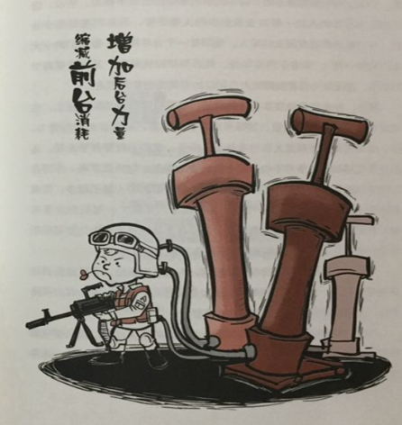

% 挖财平台技术保障部广发英雄帖
% 王福强 - fujohnwang AT gmail DOTA com
% 2016-01-14

阿里在学习了Supercell之后提出了**"大中台，小前台“**战略， 任正非也刚刚发出了新年呼吁， **让前线呼唤炮火**， 所有这些背后意味着什么？ 他们又是出于什么现状做出这些战略决策的那？本质上来说就是原来基于“人海战术，各自为战”的方式已经无法有效带动整个公司和集团的整体效能了。 所以， 为了打破现状，提高效能， 就得转型， 转型怎么转？ 沉淀稳固的资产，灵活调配变化资源， 让沉淀的资产以平台形式持续沉淀，从而以有限优质的资源向前支撑所有前端业务， 让易变的前端业务可以依托平台上沉淀的资产快速试错，迭代和创新， 从而实现整体的效能提升， 所谓”前轻后重“，即此。

平台的沉淀起步越早， 时间给与的累计优势就越明显， 所以， 2016年， 挖财平台技术保障部将加大对基础设施和平台的持续建设，为我挖及早积累技术优势， 从而保障技术对业务的中长期发展需要。

如果哪位同学认同挖财平台技术保障部的愿景并且也想持续在技术和技术产品领域沉淀并成长，那么，欢迎自荐或者推荐亲朋好友加入我挖平台技术保障部共创辉煌 💪 

## 求贤若渴（职位描述）

以下所有职位：

1. A **whole-life learner** is prefered. 
2. you should be **open-minded**.
3. you can be a dick or asshole, but you should **make sense**.

### Java架构师

我就不废话什么SSH之类了， 这是必须的， 作为一名Java架构师，你技能下得了厨房（写代码的乐趣你要有）， 还得上得了厅堂（你要能够将自己的规划和设想推广并落地）， 你行，就来跟我们的男神@巨石和大神@错刀过过招。

### 中间件和技术产品专家

2016我们将在以下领域进行PAAS式的服务治理：

1. Kafka
2. Redis
3. ElasticSearch
4. Datastore
5. virtualization(kvm, docker)

如果你感兴趣或者是这方面的专家，这里的舞台随你起舞； 当然，你最好有一点儿技术产品的sense， 否则，最好有个搭档 ;)

### 持续交付产品与研发

对Jenkins等系统以及持续集成，持续交付以及交付流程等领域浸淫已久的人们， 你们还等什么那？

### DBA

金融企业，数据为重， 你懂这个岗位的重要性 

### SRE

运维领域的大牛们，你们在哪里？ 

### 移动研发总监

移动时代， 谁领风骚？ 你， 你，还是你！

### 其它职位

1. 前端要玩NodeJS等前沿技术的同学，你们在哪里？ 
2. 对金融系统和业务感兴趣的同学，你们在哪里？ 
3. 对Scala和实时计算感兴趣的同学， 你们在哪里？ 
4. 对交易系统感兴趣的同学，你们在哪里？ 
5. 对工具，框架， 性能优化刚兴趣的同学，你们在哪里？ 
6. 对安全感到神秘的同学，你们在哪里？ 
7. Nginx和Lua那？

---

**2016, 约吗？**😉
