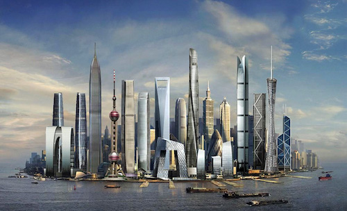
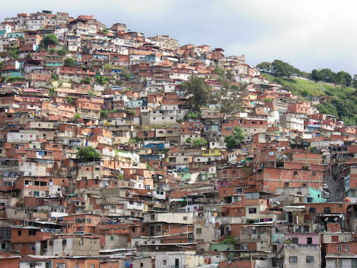

% 架构的执念
% 王福强 - fujohnwang AT gmail DOTA com
% 2016-02-18

所谓“Great Minds Think Alike”， 架构上很多东西都是相通的，架构的修行之路跟个人的修行之路随行， 如果说一个人要从`身, 心, 灵`多维度修行的话，那么，我们今天的架构话题更多是围绕着“灵（Spirit）”展开...

# 前瞻性的眼光

合格的架构师一定需要有前瞻性的眼光。

架构不是演化出来的，摸着石头过河，遇到问题解决问题，那是专家的优势和特长， 架构师不应该关注如何精妙的去解决问题， 而应该关注如何从一开始就奠定**粗糙但正确**的蓝图和基调，避免后面投入大量的资源去应对本不该出现的各种危机。 合格的架构师都应该做扁鹊的兄长那样的人，而不是扁鹊， 扁鹊是专家的偶像。

一名合格的架构师设计出来的架构是要有前瞻性的，要为了将来的组织能力更上一个台阶而设计， 满足当下需求并能够适当扩展，是遵循架构设计的系统实现要关注的事情，系统是多样的，架构不是，系统是演化出来，架构不是。

一名合格的架构师，要目光高远的去改造“世界”， 去将高远的思想化为现实， 你要做的是冲破各种阻力， 去构建大多数世人没有见过甚至没有想过的事情。 

如果搞建筑，你要搞的是摩天大楼，甚至宇宙城堡：

而不是仅仅搭建一个遮风挡雨的栖身之所：

前者体现了架构的更高价值， 后者则只是满足需求的野蛮生长， 我并没有说两种不同的生态孰优孰劣，但作为**合格**的架构师，你要很清楚自己的选择是什么。

NASA当年给赞比亚修女的那封信， 相信大家都看过， 解决眼前的问题很重要，但大部分人力和物力已经在做了， 应用，工具， 服务，所有这些都是为了解决类似的眼前问题。 所以， 作为合格的架构师， 你要做得应该是创造更高附加值的事情， 立足现状， 志存高远， 用你的前瞻性，作为先驱者， 探索， 发掘， 然后再回补， 周而复始， 走在前列。

# 系统性的思考

合格的架构师都是好的战略家， 前瞻性眼光是他们起码的要求， 而系统性的思考则是将这些前瞻性眼光落地的必备素质。

架构既看重前瞻， 又看重落地，落不了地的架构只是空中楼阁， 所以， 如何将架构落地， 考量的就是一名合格架构师的综合素质和系统思考的能力。 

因为架构的规划和落地依附于现有的环境因素很多且不可重现， 所以， 合格的架构师要能够尽可能多的将对架构有过多权重影响的因素考量进来，然后做权衡， 抓住重点因素， 然后集中兵力重点突破。 

比如， 是采用传统的Monolith架构体系，还是时下风靡的微服务架构体系， 你要能够从团队人员层次和能力， 组织和公司的发展现状， 时机等重点因素中做出权衡， 你没法通过数据建模的手段去完成这个工作， 你能依靠的，只有你的综合素质和系统思考能力：

- 从时机(Timing)上说， 如果单个应用结点就可以满足业务发展需求，那么， 就没有必要上微服务，否则反而凭空增加了整个交付链路的负担； 

- 如果团队的成员能力还不足以支撑起微服务体系相关的所有工具化，服务化和平台化建设， 那么微服务架构也不是最合适的方向；

- 如果公司业务还处在四处拼杀， 生死未卜的时候， 公司的现状也不会允许你去搞各种完善的基础性建设， 活下来才是第一位的；

对于架构师来说， 你要关注的不是“点”， 而应该关注的是尽可能多的“点”， 进而是连接点的线， 到面，甚至到体， 你要构建的是“人浪”的整体形态， 而不是指导“人浪”中某个人的“起立和坐下”， 你要关注的是“整体效率”， 而不是"单点效率"， 否则就不是`健不健，美不美`的问题了：

系统性思维帮助做出合理的决策， 但最终都是为了架构的落地而服务，所以， 在繁杂的系统因素中做出抉择之后， 要能够集中兵力攻占阵地， 这个时候考验的则是架构师的统筹和带兵打仗的能力， 你可以使用情感纽带将兄弟们团结在一起为了同一目标而奋斗， 你也可以政教合一， 像亚马逊那样通过行政上的强化，来保证“所有服务都必须HTTP化”类似的决策执行， “路怎么走， 你们看着办咯”， `No man ever steps into the same river twice!`

# 开放性的心态

前瞻性的眼光， 系统性的思考能力不是凭空而来的， 你需要“海纳百川”， 去芜存菁，然后通过独立的思考，经过长时间的积累，持续沉淀为一名合格架构师的综合素质， 而开放性心态是那道坎儿， 你迈不过去， 持续的沉淀就无从谈起。

一名合格的架构师是一座冰山， 他给你的印象可能只是很平常的小冰块儿， 但实在货都沉淀在下面：

而且， 在开放的心态下， 下面的沉淀将持续壮大。

有了开放性的心态，你才能“接纳差异”，做出合理的权衡；

有了开放性的心态，你才不会被过往的经验所羁绊；

有了开放性的心态， 你才会走上成长为一名合格[架构师的莫比乌斯之路](http://afoo.me/posts/2014-05-18-architect-is-not-the-one-you-think.html)！

# Be A Whole-Life Learner!

你认同吗？ ;-)

