% My Great Experience Of IDPA In Bangkok
% 王福强 - fujohnwang AT gmail DOTA com
% 2016-03-28
 
> NOTE
> 
> In order for more friends can read this post all over the world, I will write it in English.

I have to say I had not expected to have such a great experience when I booked the ticket and flew to Bangkok last week. When the IDPA training finished, I felt so fucking great, and that's why I have to write it down here, do U want to know more?  read on...

"**Shooter Ready, Standby...**"

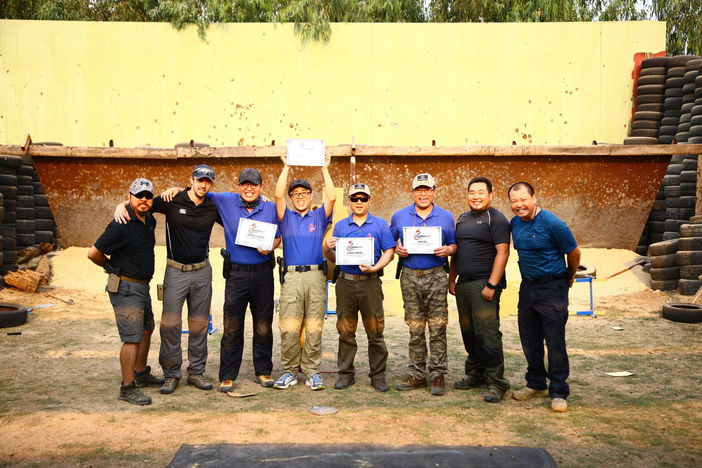

# I Met Wonderful People

here R we, the new F4, HAHA

Alley and I are from HangZhou, Zhejiang Province; 

Zen and Karry are from ChangZhou, Jiangsu Province.

We got together in Bangkok.

We have so much fun in our class, that's all because we met such wonderful guys there...

## T.J.

[Theeradej Jui](https://www.facebook.com/theeradej.jui) ^[I don't know how to spell the name in Thai language, So we call him T.J. for short] is our teacher. He is a funny guy, 

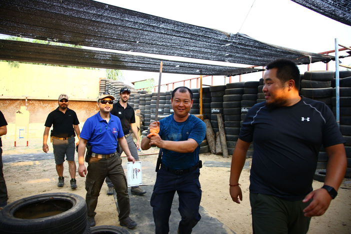

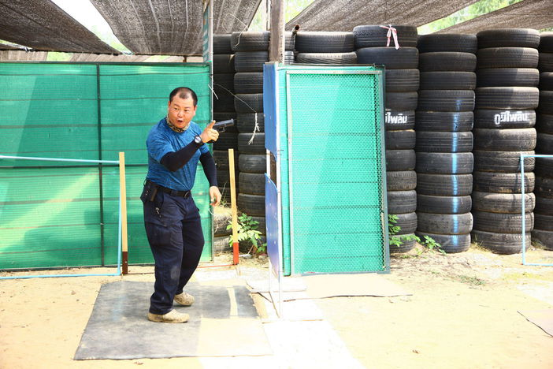

but also a GREAT **shooter**, **teacher** and **fucker** ;)

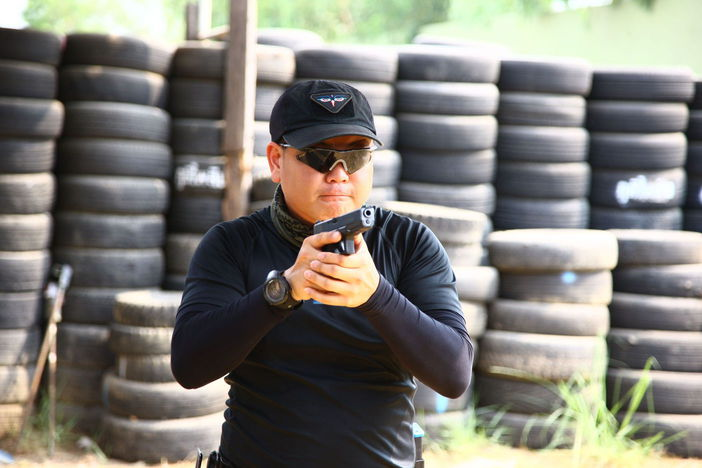

In our class, he shot 20 bullets in 19 seconds in a tac scenario without miss. He raise 61 snakes as pet, fed them once a week with rats, that's why I had thought it's the real reason that he can move so smoothly like a snake in the tac. In Chinese, we say “静若处子，动如脱兔”, I think it's talking about T.J. 

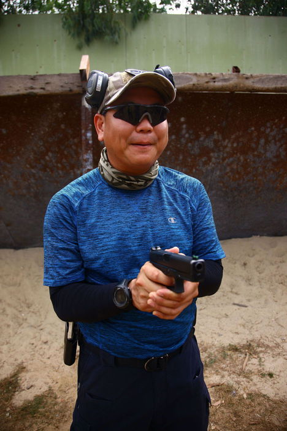

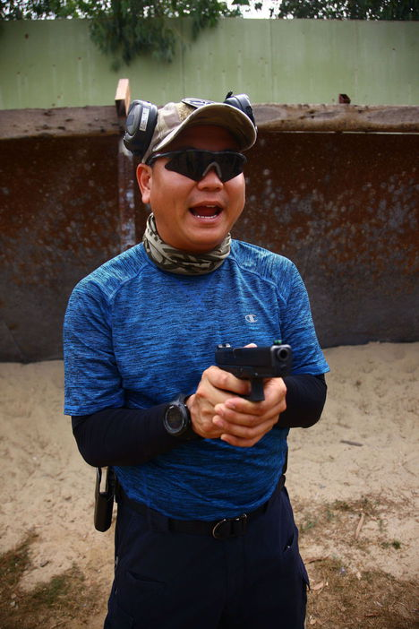

T.J. is a good teacher, a master. 

I heard he taught the princess of Thailand, he taught the police officers, he taught army and SWAT, of course, he also teach ameteur like us.

He can figure out what goes wrong in your movements and help you fix it and improve it, he can make complicated thing be so easy to learn, that makes him a great teacher who can see the both sides of the mirror.

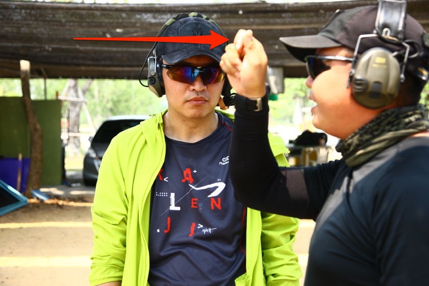

In the above picture, I still can hear his voice after days: “**Squeeeeeeze~**”,  "慢~ 慢~ 来~"(Take it easy and slow~)

T.J. talked a lot of "黄段子"（fucking jokes）， and said he is soooooo good in fucking , hahaha, I think it's true, so that's why I say he is a fucker ^_-

## Leo

Leo is the organizer of IDPA China, he has 3 countries' passport: HK, Canada and England?(I can't remember for sure). 

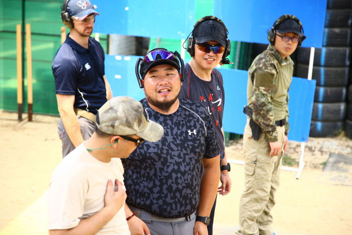

He is just 27 and has thought he wasted time in his earlier life,    R u fucking with me, man? I am getting close to 40, but has just started to try everything, U R fucking so LUCKY! 

Anyway，for me, it's **Better late than Never**.

## James & Bond 

Yeah, 007 is NOT one tough guy, but TWO. 

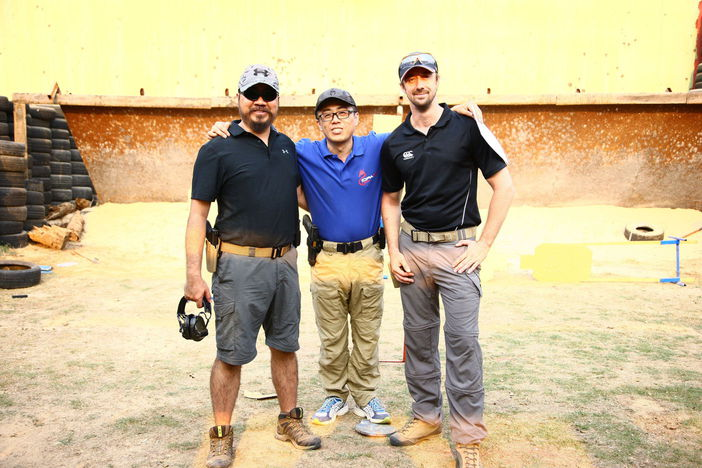

My friends, meet JAMES on my left and BOND on my right.

JAMES is from Great Britain, before coming to Thailand, he had studied the Thai language. He came to Thailand 2 years ago and will stay, "I love Thailand", he said.

JAMES gave me a lot of advices in our IDPA class.

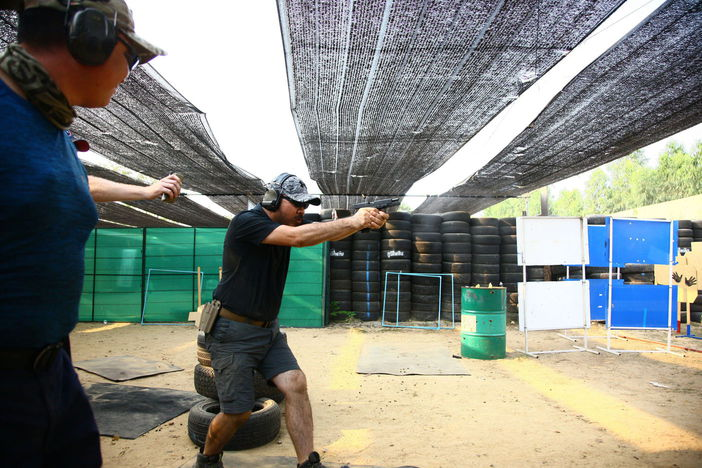

BOND is a nice and friendly guy, it seems he met his friends everywhere. 

BOND gave me a lot of advices in our IDPA class too.

## Cai Hongfa

Cai is still a mystery to me, but very nice and told me a lot of things and stories

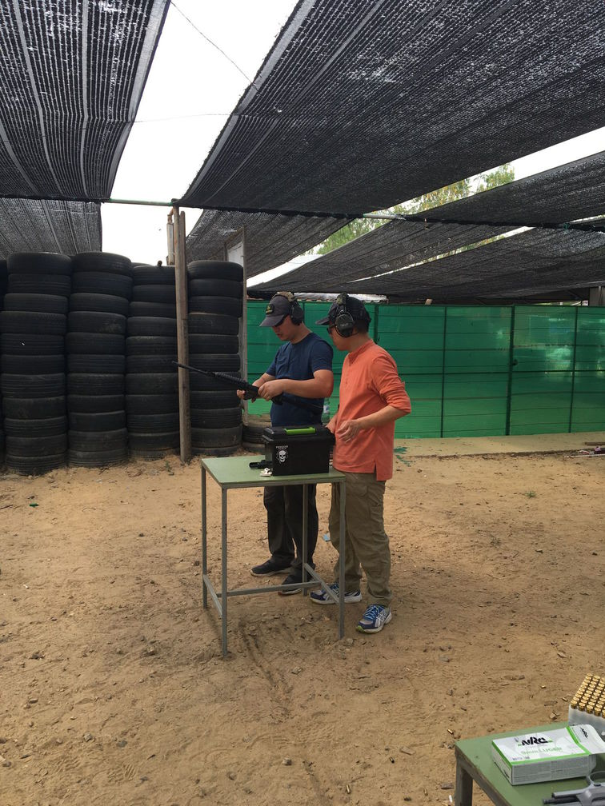

He said I should write a book or just a preface of a book on Guns and IDPA thing, like the one below? 

Yeah, maybe next time I should ;)

# I Heard Great Stories

## Female Police Officer Of HangZhou

Yeah, just the city I'm staying. 

Chinese police officers get equiped with pistols recently, but they don't receive proper training. One female police officer came home after shooting training without checking the gun whether it's empty and clear, pointed the gun to her husband, then the gun fired, lucky for her husband, but she got hurt deeply in heart and quit her job.

My friends, gun should be taken care of with caution, Safety First!

## CQB and Japanese Teams

When we are in our class, there are a CQB group and Japanese group in the neighbour, we had thought we are amateur, but when comparing with them, we knew we are NOT. ;)

## Shoot accurately is NOT easy

We all watched movies with gunfire, and you maybe thought it's fucking ridiculous as I do that `it's so close, it can't miss`.

After the IDPA training, I will never say it's easy any more.

# I Felt Different Cultrue

I can't tell it out exactly, but I feel warm in this country. 

I think I will go Thailand again.

