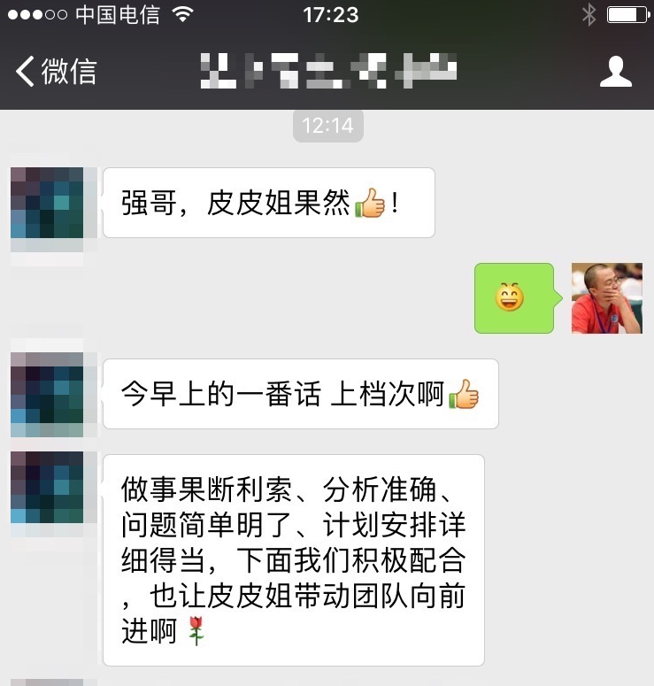

% 我就是要一心打造锐意进取的产品技术团队
% 王福强 - fujohnwang AT gmail DOTA com
% 2016-12-21

估计对于很多前挖财的同事来说，扶墙老师给他们的感觉是**相当aggressive**， 如果用“**极心无二虑， 尽公不顾私**”来解释， 扶墙老师又觉得是给自己脸上贴金了， 但确实只是想把事情做得更好，想让公司整体上（起码整个技术部门）能**系统性**的更有效率，而实际上， 就算现在自己出来创业了， 扶墙老师也依然坚持自己的这种态度， 我最不希望看到的就是一群大白兔其乐融融， 关系搞得好好，事情做得糟糟，感觉每个人都很忙碌，每个人也都尽职了，但却没有整体产出，就跟那两个种树的人一样  [^tree-planter]， 一个挖坑，一个填土， 都觉得自己很辛苦，也尽职尽责，其实tnd完全就是把过程当目标，把苦劳当功劳，把动作当成工作， 如果人人都是这样，那这家公司还有什么前途？

所以， 我要的是一只有能力，有性格，有着独特精气神儿的产品技术团队，在这个团队中， 每个人都那么的锐意进取， 与时俱进，能以开放的心态，接纳更加高效的工作方式， 吸纳更加优秀的新生力量，从而互相砥砺，相互成就，让每一个人都能成长为更好的自己。

虽然征数团队组建时间不长，但已经有很多团队成员让我和其它成员赞叹不已了...

我们的皮皮姐， 入职第二天晨会之后， 就有团队小伙儿对其竖起大拇指了：

而最让我感动又敬佩的却是， 我们的皮皮姐作为前XX理财网的CTO，每天从城北到城南（滨江）， 能够下定决心加入我们， 绝对不是一般人能够有这种勇气的！而且皮皮姐真可堪称“上得厅堂下得厨房”， 能够一天时间果决的跟我敲定产品需求和排期， 第二天就着手搭建项目工程开始编码，主动立下军令状要一个月拿结果，让新业务线产品第一版年前上线， 尼玛，我都不知道老天爷为啥这么眷顾我，让我们可以认识并一起共事， 跟这样的人一起工作，老子才有精神啊~~~

还有我们的强哥（不是我，另一个强），是我认识的人里面第二个从大连“出逃”的， “抛妻弃子”， 每天下沙到滨江长时间通勤而无怨无悔，就是为了跳出自己的舒适区， 去改变，让自己变得更强， 将来可以获得更大的成就。 为了效率，强哥也是拼了， 根据场景， 舍Java取Python， 不惜从头学也要在规定时间内拿结果出来，从态度到结果，都让我不得不服。对于强哥来说，可能也是觉得，能够跟一群势均力敌，有态度，有追求的人一起共事，打磨，成长，是一种难得的乐趣？ ^[另一个大连“出逃”者在杭州某海淘创业公司做CTO，同样是敢于放下，颇有追求的技术人]

所以， 有这么一群有情有义，有追求，能打硬仗的人， 我相信征数产品技术团队可以成长的更加优秀，我们希望在国内的技术圈里有自己的一席之地，在这片一席之地上，你们能看到我们的不一样：

1. 我们的团队成员多种多样，但个个都与时俱进，锐意进取；
2. 我们的生态繁荣多样， 从Java的微服务体系，到JS与NodeJS的端到端， 再到Nginx， Lua， Python， Go的基础设施体系， 各司其职，各领风骚；
3. 我们的态度是服务好用户， 用户说好，才能说明我们的工作有价值， 用户说好， 才能帮我们及时纠正空想的虚妄， 才能让我们更加务实；

明明知道打造一只锐意进取的团队不容易，但扶墙老师还是一心要这么做， 因为只有这样一只团队才能令我兴奋， 那种狼性的快感，并非所有人可以理解的， 也不需要所有人理解。 

假如你是一只狼， 一只觉得自己孤独的狼，但又有一股子的锐意进取的劲儿无处寻伴儿， 不妨考虑一下我们征数产品技术团队，前端同学，运维同学， 架构狮子们， Javaer， Pythoner， 撸啊撸(Lua)，产品经理，我们都还在急切的盼望着你们的加入, 当然， 扶墙老师绝对不是那种光靠梦想忽悠人的大忽悠， 一般情况下， 只要我觉得公司可以承担， 各位要的薪水我不会刻意打压（我也确实顶着压力，一直以来在坚持执行这个原则）， 但你确实也需要证明自己值，第一个是值这个钱，第二个是值与这个团队的成员共事！彼此的尊重是需要靠拿结果和自己的成就来赢得的！

这是51信用卡孙总晒的朋友圈图片，不同人有不同的解读，而从我的角度来说，我看到的是，就算一件事情已经有人在做了，你还是可以挤进去， 只要你和你的团队足够nb， 就可以杀出一片自己的天地！ 期望更多优秀的同学加入我们征数， 一起杀出一片天地出来！

“那边是飞机大炮牛肉罐头， 这边是小米加步枪， 就着冰雪吃着干粮， 不服你！”， 干！

[^tree-planter]: 故事是这样的， 有人看到两个人一个挖坑，一个填土，觉得不理解，就问咋回事。 回答是，他们在种树， 但本来规定是三个人一起，种树的那个人病了今天没来， 所以就出现了刚才那一幕。

