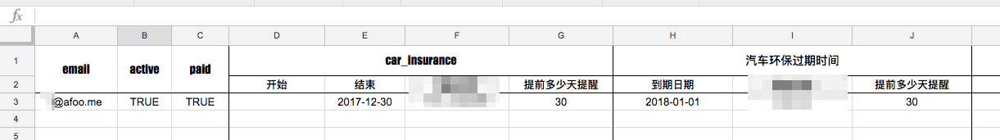
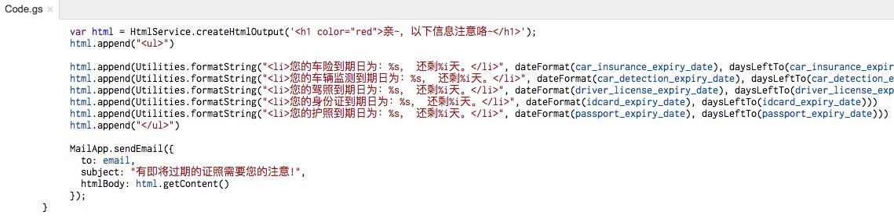
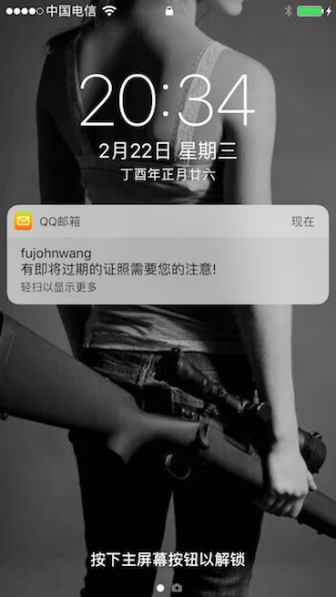

% 一个side project的原型构建过程与总结
% 王福强 - fujohnwang AT gmail DOTA com
% 2017-02-22

# 初步想法

很多证照因为更换时间跨度都很长， 最早是怕自己到了那个时间点忘记了，所以， 想写一个长期存活的服务，能够在这些证照即将过期之前某个时间点提醒自己去相应机构换新。

以当下最流行的方式实现，那肯定是微信通知， 但是担心到时候微信会怎么样了，在不在也难说，或许是我过于悲观吧，所以，以这个担心和假设为出发点，自己写个app更不能保证到时候这个渠道是可达的。 

从个人角度来说， 电子邮件显然是生命力最强的方式， 既可以作为用户的唯一标志信息，也可以作为生命力最久的触达渠道， 所以，我只要将相应证照的过期时间和提前多少天提醒等配置信息交给一个调度器，比如cron， 那么， 到了该提醒的时间点，只要发送出邮件通知就可以了（如果邮件可以同时绑定短信提醒，那就更好了）。

如果其他人要用，那么也只是通过邮件发送给我相应证照的过期日期和需要多少天提醒， 我同样配置到系统中进行调度就可以了。

# 构建过程

为了验证这个idea是否是普遍需求， 我通过一天多一点儿的时间，构建了一个side project， 用于验证这一需求是否值得进一步优化和产品化。

我的验证前提是不投入任何预算， 只以serverless的形式（即我不投入自己的任何硬件资源， 使用开放的平台或者免费服务）构建这套服务体系。

整个流程和牵扯的系统组件是这样的：

1. 用户发送邮件到指定的客服邮件地址（比如kf@keevol.com);
2. 人工接收到用户的服务请求邮件后，将用户邮件内容中的证照过期日期等信息配置到调度程序；
3. 调度程序长期运行， 并以天为调度单位定期轮训配置到系统中的证照过期日期，一旦发现某个证照还有一段时间（比如30天）就要过期，则发送邮件给用户（通过用户提交服务请求的邮箱地址）， 从而完成整个提醒服务的闭环；

整个side project的核心组件只有一个，即Google Sheets， 我们将所有信息输入Google Sheets进行保存：

然后通过app script编写调度程序，配以app script的project trigger来触发调度（project trigger这里充当了cron的角色）:

这样，当证照即将过期的时候，我们就可以收到邮件提醒了：

# 反思与小结

整个服务流程打通后，我只是通过个人的朋友圈和微博来扩散一下，效果是：

1. 有的朋友直接超额打款；
2. 有的朋友聊天之后打款；
3. 有的朋友打款了， 但我不知道是谁（这里有个流程纰漏，因为只是测试，所以支付我只是贴了个人的微信和支付宝的收款二维码，但钱是收到了，不知道是谁）

所以， 后面几天又朋友圈里敦促各位把日期信息邮件发来，没有人发过来 ：（

看来，这次尝试是失败的结果， 可能的原因我个人估计是：

1. 从产品层面来说， 整个用户触达渠道不是那么友好， 提交信息到支付整个流程都不是那么顺畅；
2. 用户可能担心证照信息泄露（虽然并不需要提交敏感信息）；
3. 从用户心理层面， 尤其是跟福克斯同学某天聊天之后， 感觉用户更多的是在乎你能怎样帮我解决问题，而不是怎样帮我预防问题。 **问题没有发生之前，都不是问题！**

以上纯属个人YY， 以此纪念这个不成功的side project测试 ^_-

