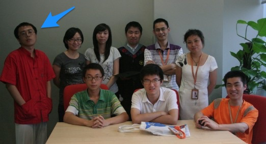

% 选择了创业，你就选择了不确定性！
% 王福强 - fujohnwang AT gmail DOTA com
% 2017-07-11

今天我的某个创业者朋友让我帮忙转发一个问卷调查， 嘱咐我不要说是他的问卷， 我不知道他本意是啥，只能凭自己的“小人之腹”猜测， 可能是业务发展方向受限，要寻求转型了， 但碍于面子，不希望让之前的老同事，老朋友知道，觉得创业未成， 羞于见人，哈哈

如果真如我猜测的那样，那我觉得这其实真没啥。 如果还是当年做专业技术工作的时候， 我会抛去“鄙夷”的眼神（看下面，看下面， 2010年左右福强老师就是这么屌）， 

但现在绝对不会了， 因为我折腾过了， 知道创业者跟打工者完全不是一回事。

**你一旦选择了创业， 做自己航船的主人，那你就选择了应对一切不确定性，选择了无常。**

创业者跟打工者是两类人，他们分别遵循不同的规律行事：

1. 打工者遵循客观规律作为行事准则， 他们强调的是专业能力， 他们喜欢用对错和是非作为价值的判断标准， 客观规律有迹可循，所以，他们享受的是确定性；
2. 创业者则遵循的是主观规律， 不光是自己的主观， 还有其他人的主观， 他们不但要面对一个复杂的自然系统中的各种不确定性，还要面对自己和他人的人性中的不确定性；

做了十多年的专业技术人员， 我深深的感觉到转型之路上的痛苦， 在企业业务的后端持续战斗了十多年，对我去主攻业务前端反而成了劣势，因为完全就是两个游戏规则， 两种玩法。 

现在，你作为船长，要自己去寻找方向，按部就班只属于过去， 探索未知才是当下的主要职责。

企业家阶层是值得赞扬的，原来的路子走不通，再找新路子，还得是极其顽强去找新路子。

所以， 探索未知，面对不确定性是创业者的常态，尤其是领军人物的常态，没有必要shy，拥抱变化，拥抱不确定性才是创业者和领军人物当下要接受并享受的。

我家贱内前阵子一直追问我，你将来怎么打算的啊， 有什么规划啊，blablabla， 我回答她不知道， 可能让她很失望，但事实却是，如果我还是过去那种按部就班的混职场，可能我会告诉她一个短期内相对明确的打算和规划，但现在我面对的却都是未知的， 不确定性的东西，我确实不知道也没法知道。 我唯一能够许诺的是， 会尽量经营好这段感情， 坚守那份初心。

创业者也是如此，你只能把握初心，坚守初心， 但将来是一个什么样子，目标在哪儿，很多时候你是不知道的，也是你把握不了的。 你能做的只是坚守初心， 尽人事，听天命，不但探索， 不断试错，最好还能享受这个过程 ；）

GL & HF

