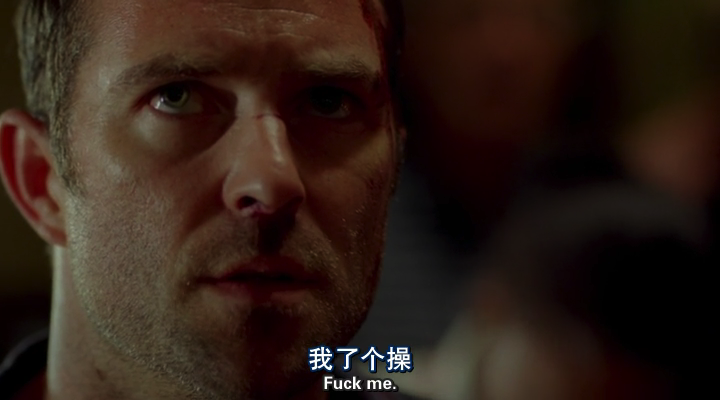

% 荒诞之梦
% 王福强 - fujohnwang AT gmail DOTA com
% 2017-09-08

同样可以参读微信公众号文章 [荒诞之梦](https://mp.weixin.qq.com/s?__biz=MzIzNzkzODU5Mg==&mid=2247483700&idx=1&sn=406eff690f756f584408f99cb040a1ab&chksm=e8c1b3fbdfb63aed7a51f31550f77027a72151b2a199d52adbd994bd4c4b9fc7b609da5483f6#rd

昨天晚上做了一个很诡异的梦，梦到阿里的股价一泻千里（我一般都是睡觉前看下美股，睡醒了看眼，觉得有机会就下个限价单）， 从170多跌倒了1.37美金，最终反弹到5.49还是多少收盘...

究其原因是， 马云在年会上说要分拆现在已经上市的阿里业务，分批再注入， 而分批的业务是第一批“支付宝宫”，第二批“什么宫”（卧槽，难道是黄金十二宫的节奏，不过好像是貌似各种食品类名字）...

mmd， 明明今天阿里才开年会吧， 我居然昨天晚上做了这么荒诞的一个黄粱一梦，😅，好在早上惊醒了看了下盘，没有这回事儿， 我这得多么不盼个阿里的好啊…[捂脸]

