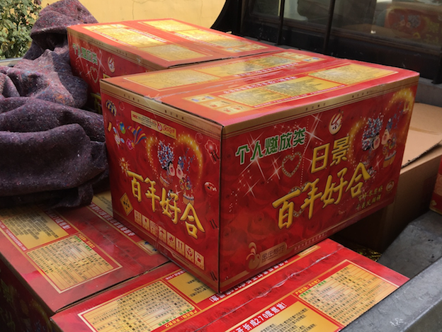

% 结婚筹备曲
% 王福强 - fujohnwang AT gmail DOTA com
% 2017-09-20

## 2017八月份

提前回来采购了各种东西，当时忘记记录了，所以这里略带一笔，包括各种喜字，喜糖盒，囍匣里的物事，比如红盘子，红火柴， 镜子， 花瓶，盖头等等， 有时候是想到啥开车出去买啥。

然后是定婚庆公司，没经验啊，定的这家招远本地的巴黎婚庆和婚纱摄影事后发现有点儿坑人，不过还是被我老婆劝住，我忍了， 本来想中途换掉。

> 南北服务水准真不是一般的差距大呀， 本来你花了婚庆的钱， 婚庆公司作为服务方应该承担类似总策划师（总架构师）的角色和职责， 什么时间点做什么事情，主动联系你，提醒你， 这可好，完全是我天天问下步干啥。
>
> 所以， 后面有结婚的朋友或者家里有结婚的人，选婚庆公司的时候，最好把服务细想都跟对方敲定了落实到纸面，不要嫌细，嫌麻烦，筹备婚礼本来就是一个繁琐的事儿，要不怎么会有兄弟感叹“不离婚了，结次婚太麻烦了”呢！
>
> 另外，付款计划也设计好，不要被婚庆公司牵着鼻子走， 最好分三步走， 这样兼顾双方的利益，我认为是比较合适的做法， 361可能不太合适， 个人觉得334在这种场景下比较合适。

然后是拍婚纱照， 我勒个去， 真tnd累活， 2，3天都在外面折腾，体验并不像照片上看起来那么好。

这些事情前期忙活差不多了，两个人暂时会杭州和上海买买礼服和对戒，老婆大人顺道还得出出差，正好有朋友给弄了乌镇的CTO大会，我也顺道去了趟乌镇。

2017年9月17号早上7点从上海出发回山东，先去丈母娘家放下到时候要办宴席的烟和酒，然后趁着暮色赶回老家。

## 2017.09.18

白天提前跟家里人打电话和微信联系， 晚上组织了个家庭饭局，借机也是去婚宴的饭店试菜。 

晚上十三四个人，不过说实话这饭吃的也挺糟心的， 各自在哪儿吵吵，饭局上我四叔还闹脾气，喝大了，直接不知道中途去哪儿了，打电话确认到家了才放心，没个叔叔辈的样儿。搞得我饭桌上直接血压飙升，又不能发火，直接从这天开始头疼，血压吃药也下不去，nnd， 别人家做新郎舒舒服服做新郎就行了，我这得啥都跑，啥事儿都得操心，跟我媳妇儿说的，这婚完全就是我们俩花钱自己哄自己玩。

我表哥比较有眼力劲， 吃完饭单独和我表嫂又来家里坐了坐，聊了下婚宴的事儿，10点才回去。

这一天过得， 一个字，头疼。

## 2017.09.19

上午，京东上买了婚宴用的白酒。

让我妈早做中饭， 12点去城里跟表哥会合去城外买烟花和鞭炮，还亏表哥搞了个皮卡，否则我这车都装不下...

下午，去婚庆公司取婚纱照，并订婚车（离婚期有些近，时间上有点儿晚了， 被小宰，但也没办法）， 订了第二天下午四点跟司仪见面初步商谈结婚当天流程。

晚上，跟我哥约了到他家一起合计一下结婚的一些细节，哥俩边喝茶边过流程和过程中可能存在的一些问题，并合计关键点什么事儿落实到什么人， 务必要求每件事落实到每个人， 避免结婚当天乱哄哄的，觉得很多人可以用，实际上到时候都不知道跑哪里去了。

> 血压高，头疼第二天...

## 2017.09.20

上午去镇上买女宾喝得饮料和婚宴饭桌上的东西， 顺道取了快递。  

挖财也是趁机凑热闹，重签期权协议， 就让快递这里帮我打印了两份签完字走顺丰发走。

回来一直到下午整理喜榜名单发给婚庆公司， 稍微小睡了一会儿，然后四点开车去婚庆公司，跟司仪初步确定结婚当天的相关事宜。

晚上回家整理需要制作胸花的名单，然后发给婚庆公司。

吃完饭，整理了下思路，写下这篇初稿。

明天计划

- 去城里买喜糖装袋
- 买一些不够的红喜字和对联
- 顺道去婚庆拿一下结婚当天要大屏播放的视频

> 今天nnd血压还是高，头还是疼，艹

