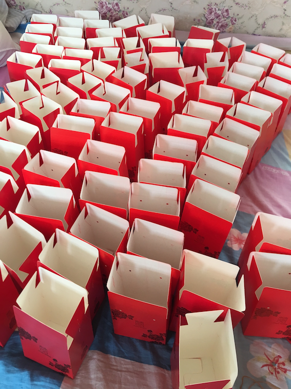

% 婚礼筹备曲续
% 王福强 - fujohnwang AT gmail DOTA com
% 2017-09-22

# 买喜糖日（2017.9.21）

上午去镇上取快递，老婆的新鞋；

下午去招远城里买喜糖， 之前别人介绍的那家卖喜糖的地方找了好久，找到了，人家说不做了， 又得找其他地方，三点一直转到5点半才差不多买好， 顺便买了两束花做装饰用；

晚上回来喝了两碗小米粥（这几天晚上只喝粥，一个是血压高，不想吃肉也不想吃多， 另外是家里小米新出的，喝了两三碗小米饭到早上也不饿，这几年金岭镇的小米出名了，有的都能卖到20一斤）， 然后跟媳妇儿把糖盒组装起来，串绳， 装糖，关上包装， 折腾了50盒先睡了， 这东西还真费时间那..

# 给父母买衣服日（2017.09.22）

上午送媳妇儿回娘家了， 得回去看看她老爹（因为上年纪了，80多， 血管粥样硬化， 供血不足老晕，且有点儿小脑萎缩，所以住院观察）， 临走， 领她先到集上买了几斤羊肉， 然后去超市选了个三层的保温饭盒，方便回去做点儿好吃的给她老爹送去。 

送走媳妇儿，回来自己开始组装糖盒，装糖， 折腾到中午吃饭， 小睡一会儿，待会儿陪父母买衣服去...

给老妈买了两套衣服，一套婚礼上穿的正装，一套外套，春秋穿，一双颜色比较亮丽的皮鞋； 给老爸买了套西服和皮鞋； 顺道给自己买了件小风衣+牛仔裤 ；） 

因为昨天买的散糖感觉不够分， 今天又去买了4斤多，然后打道回府，到家快五点半了， 回来整理婚礼当天相关人员的联系名单，便于当天临时找谁找不着。

哦，对了，还得找一个曲子的伴奏，媳妇儿非得要求婚礼当天给她献唱一首...

晚上将所有的糖盒和糖都包完，收工。

