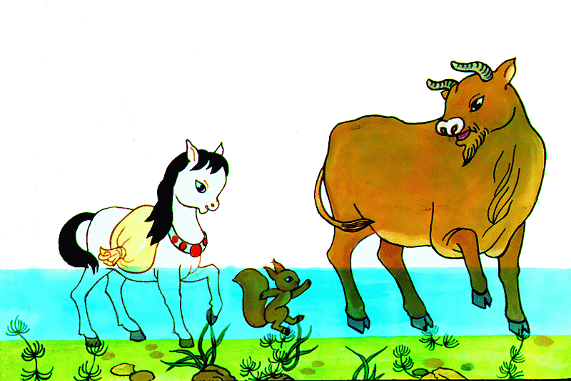
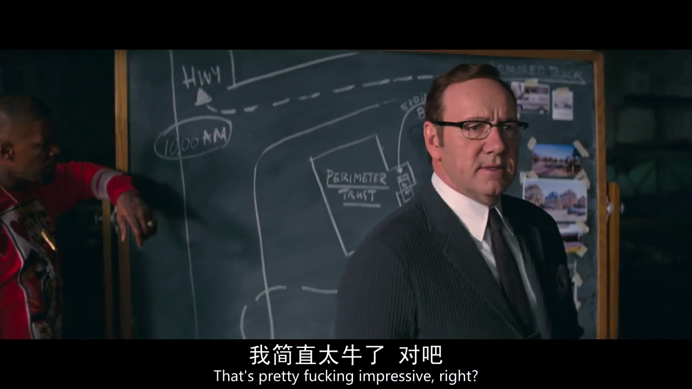
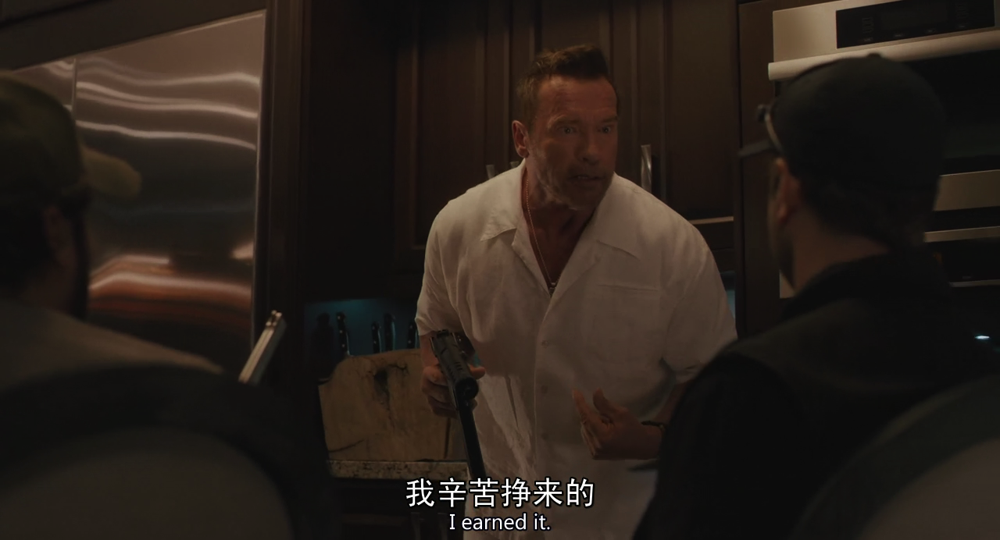

% 你的迷茫我解答不了
% 王福强 - fujohnwang AT gmail DOTA com
% 2017-10-08

今天挖财一名小美女让我帮忙解惑，做回人生导师，可是，负责任的说，臣妾可能做不到啊， 人生之路，小马过河，谁的经验对你可能都无法100%匹配借鉴，你只能自己走过去试试才知道...

# 没有特长就没有竞争优势？ 未必！

小美女说，她一直理解或者认同的道理是，`没有特长就没有竞争优势`。其实这个未必！

如果将谋生划分一下阶段的话， 有一个阶段你可能是要通过出卖体力或者脑力或者both来谋生的，也就是我们所说的专业性， 在这个阶段里，上面这个道理是合理的。

但当你进入下一个阶段，比如靠资本谋生或者靠组织和经营谋生的时候，特长或者个人优势所代表的专业性所起的作用就没有那么重要了，甚至还可能成为阻碍。

[马云:我爸说人要有一技之长,错了!](http://www.miaopai.com/show/EuDgzRp7oZrxTUf3OzvY~hLGb4toGpp4SvA1GQ__.htm)

如果你能理解上面马云说的这番话，那么，你应该可以理解我在说什么。

或者这幅插图里的Kevin Spacey所饰演的角色，他不是靠专业性谋生的，边上那个哥们则是。

# 职业生涯规划得来吗？

那么，职业生涯可以规划的来吗？ 职业生涯规划这个词儿前几年挺火的，对于这个问题，我也不好说，因为我没有这方面的经验。但个人觉得，可以有，但不一定能长期有效。

前阵子跟一位老先生聊过他的一个想法，跟职业生涯规划的场景有些像，但我不觉得这个东西可以规模化，所以，也就没有想进一步沟通。如果你看一下这个人的面相，就能知道这个人的命运，那么这个世界就太简单了，用面部识别程序直接扫描每个人的照片就把这个世界安排妥当了，而我不认为世界是这么运转的。

你看到这个人的面相，可以说出一些东西，是因为你看到的是到目前为止，这个人的经历和精神状态，虽然这些对这个人后面生命经历有些延长作用，但人生无常，不一定什么因素就打破了这条延长线，未来是无法预知的， 看未来远没有看过去清晰！

# 拥抱变化， 不忘初心

工作两年就能够深刻了解自身的优势可能言之过早了，任何事情都是需要沉淀的，虽然投机也有成的，但我自己宁愿相信正心跬步，慢慢积累，**Changes take time**

施瓦辛格老先生演的这个片儿很烂，这张插图是我唯一留下来有价值的东西，话有双关，看官自己揣摩吧~

# 彩蛋

扶墙老师下一部著作《The Way Of Deep Thinking》预告，敬请关注 ；）

