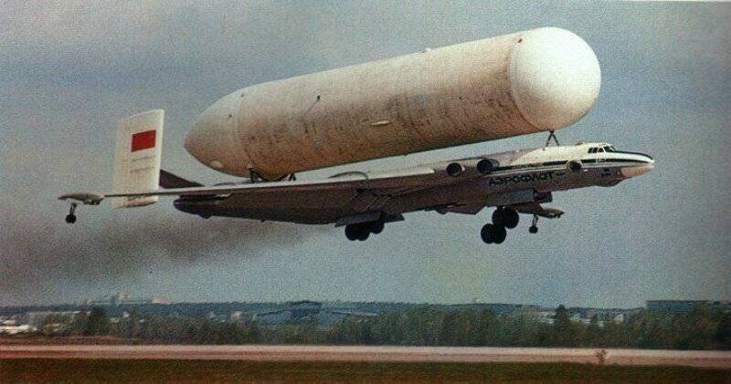

% 战略轰炸机， 自动驾驶与高铁
% 王福强 - fujohnwang AT gmail DOTA com
% 2017-11-29

早上朋友圈宝鼎同学发了条信息， 不知道背景是啥，因何而发， 不过跟自己这几天的所见所闻所说倒是有些契合：

>  量体裁衣的裁缝是好裁缝，炫技自嗨不是客户第一。

下面这幅图是俄罗斯的战略轰炸机米亚4-”野牛“， 改装了之后向东亚运输天然气， 那么问题来了？ 用战略轰炸机来运天然气，是不是有点儿太奢侈了那？

其实不然，存在即有存在的理由， 其实对于俄罗斯来说，这样做可能是最合理的： 俄罗斯东亚领土地广人稀，如果像我国这样，大兴土木搞铁路这样的基础设施， 投入大，但利用率不高，显然不经济，所以基于战略轰炸机背天然气罐这样的低频但灵活的运输方式可能就更适合，也更经济。

我在做内训的时候，有的同学问我，是不是自己的公司要照着我说的规划和设计去做，我也说过， 你可以借鉴，但不能照搬，因为每家的情况是不一样的：

- 美国先搞自动驾驶，或许是因为美国是最早的汽车上的国家， 加上人口分散，幅员辽阔，很多人经常要长途驾车，那么，搞了自动驾驶之后，就可以帮助驾驶员缓解长途驾驶的疲劳；
  - 自动驾驶本质上其实就是自动巡航的升级版，高速公路等场景最合适， 至于野外（越野场景）或者拥挤的城市等场景，不一定有效（当然也可能我是错的）。
- 我国大建高铁，是因为我们人口多， 人口流动大， 尤其是东部，投入一次的基础建设，可以频繁重复利用，自然性价比更高；
- 俄罗斯东亚人口更少，地域更广，所以定点低频运输自然也就更合适；

所以，做规划和方案要结合实际情况进行， 而不能一概照搬，否则空耗成本，可能产出却很小，合适的才是最好的， 而不是最高大上的，最贵的才是最好的。

