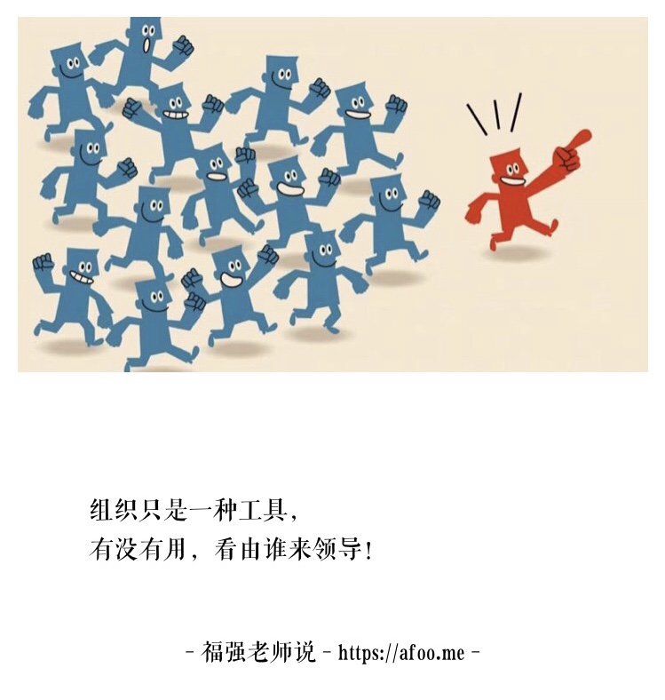

% 要找CTO， 你有没有想好选I还是选E？
% 王福强 著
% 2018-05-26

遇到很多CEO找我帮忙介绍CTO或者想找我当CTO，所以，这里给创业公司的CEO们一些如何找CTO的建议， 希望有帮助。

各位CEO们如果在打算找CTO，那么， 你要先问自己一个问题： `你能承受的试错成本是多少？`， 为什么这样说那？ 因为关键点就是这个试错成本，引申开来就是，在自己能够承受的试错成本上到底是选择要**内生（I)**还是要**外寻（E）**！

内生的理念是，作为CEO，一名领导者，你关注人的成长，所以， 更加愿意从公司内部选拔CTO， 即用人所长（zhǎng）， 我是很认同这种理念的， 但是，带来的成本就是， 人在成长的过程中是会犯错的， 只有跌跌撞撞之后才能成长， 这些犯错的成本往往就无法避免，这就是我说的试错成本。 

事情上，技术选型上， 所有谋事层面的决策，犯错都是可以接受的， 而人选择错了， 试错的成本就大了，包括但不限于CTO， 团队中核心骨干的选择和决策往往蕴含着极大的人事试错成本。

人选对了只是第一步， 这些人在成长过程中做决策，做事情等日常中也要试错， 扩散延伸到整个组织中就是，CEO的胸怀必须足够大，否则没法理解和包容这么多的试错成本。

那这些试错成本能不能减少或者避免呢？本质上来说可以减少，但没法避免， 那么如何减少呢？ 这就来到我们要谈到的**外寻**。

外寻的理念是什么那？ 就是通过借鉴外部第三方在这个领域的专业经验， 以期避免或者减少组织内部在人和事上的试错成本。创业公司因为组织还没成型，没有足够的人才梯队可以内生，所以只能诉诸于外寻， 一些企业因为业务发展太快， 内生速度不够或者目标核心人物的成长速度跟不上，又或者CEO想“买个安心”， 往往也会寻求外寻的方式。

但外寻其实只能帮你尽可能的减少试错成本，而无法完全避免试错成本，这句话怎么理解那？ 我们应该清楚的认识到，外寻的CTO可能不适合这个组织，或者跟你无法密切配合，导致的摩擦多于紧密合作的顺滑，这时候，你就得忍受外寻CTO在组织内部的试错和成长，要么你就得重新外寻，但不管怎么样， 试错成本只是转嫁了，而没有消失，所以说试错成本无法完全避免。

但是，试错成本可以减少， 为什么那？我有个朋友创业之后专门帮创业公司找CTO， 他们的理念就是， 我运用我的专业知识和经验，帮助创业公司找到匹配合适的CTO，这样，就可以帮助CEO们减少因为自己不懂技术而导致的在寻找CTO过程中的各种试错，收取的成本一定会比你自己内生或者外寻导致的试错成本要少，他以专业换取了合理的资源，你又以少于原先试错成本的代价找到了合适的人， 大家皆欢喜。 当然啦， 我司[杭州福强科技有限公司](https://www.keevol.com)为企业提供技术和管理咨询服务也是一样， 本质上都是为企业提供验证过的经验或者领域的专业能力，帮助企业减少试错成本来构建一个双赢的商业闭环。

CTO之所以难找， 其实是因为大多CEO都不是技术专业出身， 加上每个人都是不一样的，在碰撞和磨合的过程中也会经常性的**错配**，加上企业生命周期不同阶段对人的要求也不一样，所有这些因素纠缠在一起，让整个寻找CTO的过程变得复杂而充满不确定性。 

但只要CEO自己有一定的认知， 结合扶墙老师本篇文字提到的`内生和外寻`的原则及建议，相信各位CEO们现在再去寻找CTO应该不会太过迷茫了吧？！

Good Luck，如果感觉不lucky，也可以找我帮忙  ；0）

---

