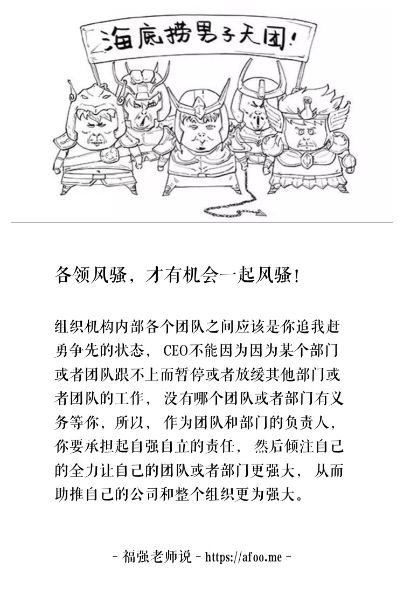

% 你弱你有理，只能抛弃你
% 王福强 著
% 2018-05-27

其实我不是想说某一类人，我只是因事有感而发，想借此说一下公司或者组织的成长之道...

故事是这样的： 某家创业公司起步阶段， 找的技术合伙人是做NodeJS应用“起家”的， 业务初期， 应用和系统快速落地，一切还不错。 某一天， CEO从ABB公司挖来一个运营的合伙人， 短短半年业务就突飞猛进， 这个时候，错配的矛盾就来了， 应用和系统频频出问题， 技术合伙人又一筹莫展， 技术团队成了公司的瓶颈，最后的结局是， 这个瓶颈和死结没有打开， 那位从ABB公司挖来的运营合伙人走人了...

这是一个悲伤的故事， 但却又是一个很常见的故事， 当公司和组织内部“五脏六腑”无法协调的时候，往往就会生病甚至死亡。

只是创始人或者CEO都会竭尽全力避免自己的公司和组织走向死亡，所以会从全局考虑，适当的给与协调和帮助，但真的只是帮助一下就可以解决问题吗？这次这个团队要帮，下次呢？

一个积极向上成长的组织， 不能靠CEO一个人顾全大局来拉动， 适当阶段要靠组织和文化营造的氛围和环境来调动和促进，每个部门和团队首先要`自强`，然后才能`万强`。只有大家各自你争我赶勇争先，整个组织才能健康向上成长。 每个部门和团队的能力永远是不一样的， 不要妄想拉平所有部门和团队的能力，更不要尝试整体慢下来去等某个部门和团队， 即使是CEO，也不应该为了补齐“短板”，就让大部分部门和团队放缓或者暂停他们的手头工作和目标规划， 即使你觉得是为了全局考虑，但这些部门和团队则没有义务为了最慢的而放缓自己的步伐， 毕竟， 各自的屁股是不一样的。你不是军队，有些原则在这里不适用。

虽说`团队中最慢的人决定了团队整体的速度`，直觉上大家都要去帮助那个最慢的人，但实际上还有更好的方向和追求，即各自争先，从而整体向前。 对于CEO来说也是，最好的做法是永远盯的都是增长，增长，增长...

作为部门和团队的负责人自己也要清楚， 没有人有义务等你，帮你是情分，不帮你是本分，你更应该做的是组织和打磨自己的团队，让自己的团队更强，当大家都这么做的时候，整个公司和组织也就自然会欣欣向荣了。

组织内部团队和团队之间，团队内部成员与成员之间， 项目与项目之间， 事情与任务之间，永远会存在错配， 这是无法避免的，CEO唯一要做的或者能做的就是，尽量通过营造环境和高频互动的机制来减少这些错配的时间窗口，而部门和团队负责人要做的则是在整体的文化和环境下自强自立，先“独善其身”，才有能力和资格去帮助别人，当大家都这样的时候，其实也就没有那么多忙要帮了。

自强则万强，**只有各领风骚，才有机会一起风骚~**

