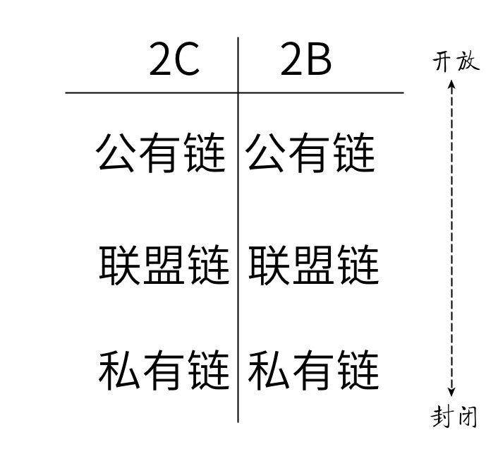

% 关于区块链的三点看法
% 王福强 著
% 2018-06-04

# 信息上链没啥挑战， 最有挑战的地方在上链前

有段时间我一直在“空想”一个idea：**遗嘱链**。 区块链的不可篡改特性为遗嘱的可信度奠定了很好的基础，  但是， 区块链上的信息纵然可以享受到区块链的种种特性优势， 可是我们更应该思考的却是，上链之前的信息如何保证其可信度呢？

是不是谁都可以把信息写入区块链，然后所有人就得认同说这个信息就是可信的？ 显然不是。 

我们天天听到某东或者某里率先推出基于区块链的安全食品溯源， 问题是，你上链之前的信息如何保证它就是可信的？要真得达到食品安全溯源的诉求，显然你就得把品控， 卫生检验等各种线下的服务都纳入这个体系， 以公正的形式将检验过的信息入链才行，然后才是区块链上信息的可信度。

为什么现在很多帮银行做信用证上链，或者票据上链等项目的团队，依然需要配合线下各种机构一起来做这个项目？ 原因就是，作为信息的接入方，你要在线下保证信息的可信度， 所以要跟公证处， 律师事务所等组织和机构一起合作来保障接入信息的公信力。

对于遗嘱链来说， 为什么传统的立遗嘱过程是要有最少2-3位公证人，还要有一些规定的机构和流程， 就是要保障遗嘱信息的公正性和可信度， 进而在有纠纷的时候可以走法律程序， 要做遗嘱链，显然这些入链前的工作和与相应机构的合作是更重要的事情，入链最终只是达到信息存储的目的罢了， 只是这个存储有个优势不可篡改， 恰好符合遗嘱立完之后的诉求。

所以， 真要信息上链，那就先做好线下上链之前的准备工作吧！

# 2B和2C的场景才是区块链的正确切入方式

在区块链的生态里，有一部分创业公司一上来就搞区块链的基础实施， 但说实话， 我觉得这不是切入区块链的正确方式， 因为越是底层横向支撑的东西，投入越大，投入时间越长， 最终长跑之后剩下的也就一两家垄断的，就跟现在的公有云态势相似。

实际上，创业公司更应该讲求短平快，快速找到切入点占领根据地才是王道，只有立足之后才能发展，那么，如何切入？

我觉得， 创始人就得想清楚你是打算做2C还是2B的生意， 然后再选垂直细分的业务场景进行切入， 之后，选择什么链， 做什么特定的链就更是事半功倍， 而不是一上来就要搞一个通用的链， 既劳神劳力， 还不一定满足所有人和所有业务场景的需要， 还不如就先短平快的搞一个只服务自己细分场景的链更高效。

# 从信息孤岛到"信息孤链"

设想用计算机来重塑人类的组织结构和形式，我不敢说我认同，但如果按照历史经验来看， 链最终也会逐步走向某些私有链壮大的方向，就跟最初互联网最初是开发的，但最终现在占有最大利益的都是那些封闭的平台一个意思。

我觉得人性是不会变的，所以， 即使区块链发展起来， 走向也会是如此。

过去和现在有信息孤岛，不是技术上不行， 不是技术上搞不定，而是各个利益方所在的屁股不一样。 

现在各种链，各种分叉本质上也是群雄逐鹿、各自占地的一个过程，等尘埃差不多落定之后， 三国鼎立之势也就形成了。

要连接各个链？ 搞“外交”先！

