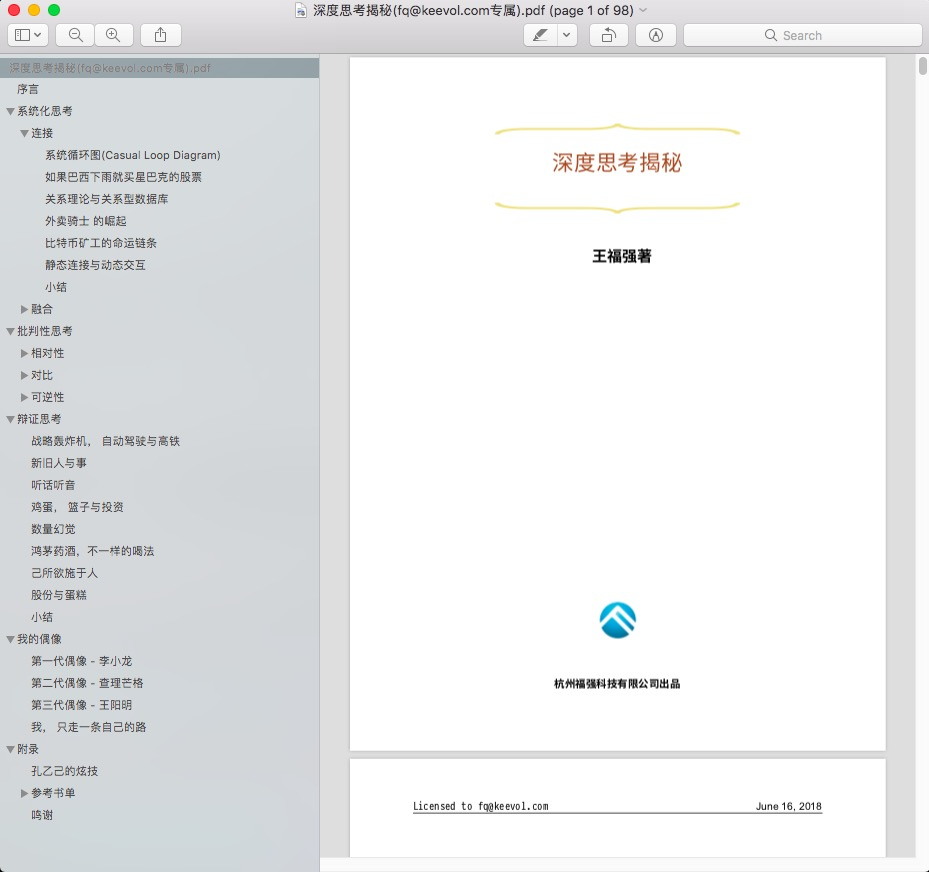

% 不要以穿越沙漠为荣
% 王福强 著
% 2018-06-20

今天参加了盈动资本第一次开放的内部分享活动， 对'大象'的分享有很多点儿都很有感触，不过想着重说说最后这幅图:

单独看到这句话，很多人估计是懵逼的， 其实本质上是在说 **选择** 的问题， 而你的选择决定了你是否坚信这种理念。

大部分人其实是靠拼专业能力起家的，在这个scope内，我相信，你应该信奉的是`努力工作， 吃苦耐劳，艰苦奋斗，自力更生...`。但是， 这些准则也好，励志鸡汤也好，终归是在一定scope内才适用。 当你跃迁到不同的scope或者阶段之后，如果依然还坚信并坚持原来的信念和做事准则，其实是有些不合时宜的，也是吃力不讨好的。

我记得又一次在`菜鸟`办公楼那边跟排风聊天的时候，排风跟我讲过一个故事，更多细节我不记得了，但有个细节是这样的， 就是她当年的领导问了她一个问题， “排风啊，你家里人是不是一直教导你什么事都要努力工作？” （大体是这个意思，原话记不清了）， 这句话背后的意味，我不知道排风有没有体会到，但我却经常跟我老婆说，**做事情不用那么用力过猛**，其实是一个意思。

很多时候，你总结的道理可能只是阶段性的，有窗口期的，或者只是小范围内适用的。 能总结当然很好， 但如果能少试错而看到全局， 就更好了，这个时候，你就可以游刃有余，知道什么阶段该喝什么'鸡汤'， 从而也就不会认死理儿，人也会看起来不那么正经了。我想， 分享结束之际最后那句话，可能也多少有点儿这个意思吧？！

---

帮别人打了广告，也给自己`王婆卖瓜`一下， 扶墙老师新书《深度思考揭秘》已成，对于系统性思考，也有多少浅见，感兴趣可以一读 ；）

<https://afoo.me/books.html>

