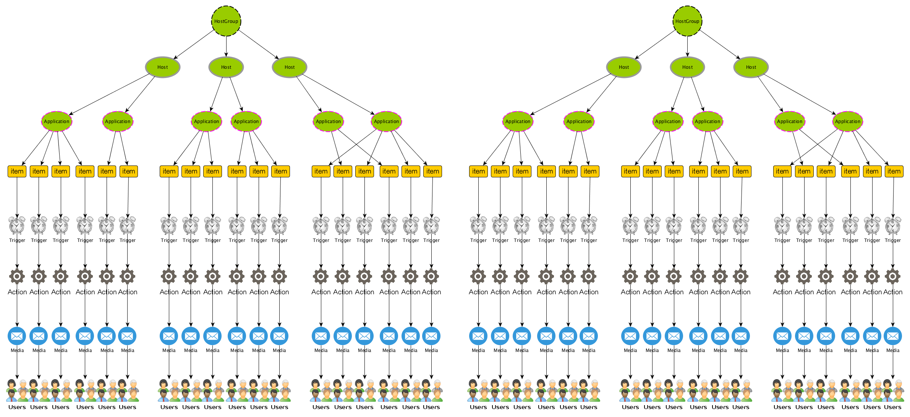

% 快捷参考

# 技术类

## Jolokia

[Jolokia Access Patterns](references/jolokia.html)

## MySQL

[MySQL整数型类型区别](references/mysql-integer-types.html)

## Git

[我的git参考手册](references/git-manual.html)

## MAC

[MAC OSX 系统管理命令汇总](references/mac-osx-sys-admin-cmds.html)

## Zabbix

# 生活类

1. [万一手机丢了，立刻做六件事！](references/six-things-you-must-do-after-phone-lost.html)

