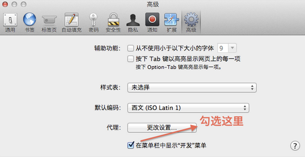
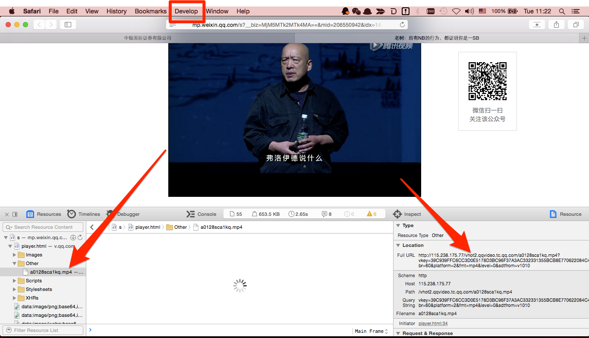

% 如何下载网页中的视频
% FuqiangWang - fujohnwang AT gmail DOTA com
% 2015-06-09

# 分析页面资源下载法

预备工作要在Safari的偏好设置中打开开发菜单。一切的操作都要建立于“开发”菜单下的“显示页面资源”功能。

打开一个视频资源页面，点击菜单栏上“开发”(Develop)选项，并在下拉菜单中点击“显示页面资源”（Show Page Resources）, 整个网页的一切资源——图片、音频、视频等等都会出现在新打开的页面资源框中。

选择网页对应的页面(player.html)并展开，选择Other子目录并展开，应该可以发现对应的视频资源， 到右边的Layout中寻找其对应的地址，然后就可以下载啦：

~~~~~~~ {.bash}
aria2c http://115.238.175.77/vhot2.qqvideo.tc.qq.com/a0128sca1kq.mp4\?vkey\=39C939FFC6CC3D0E5178D3BC96F37A3AC332331355BCB8E770622084C44713E7B6624A57C1A869B7B999AF8C5BE6DDF56134C0461ECFBC4AC741B403CEFF7820A7A4E4DAE3213F1B4A31688341D708AE5015396E15C5CFB7\&br\=60\&platform\=2\&fmt\=mp4\&level\=0\&sdtfrom\=v1010
~~~~~~~

# 参考
1. <http://bbs.feng.com/read-htm-tid-6373749.html>